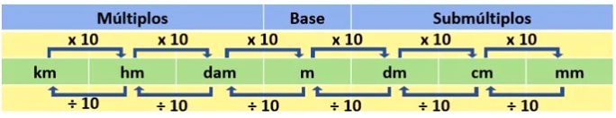
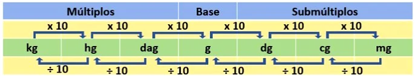

# Sistema legal de medidas

- O sistema legal de medidas, são o conjunto padrão de unidades de medida, utilizadas para expressar grandezas.  
- Existem medidas lineares, bidimensionais e tridimensionais. Todas as unidades partem de uma unidade padrão, sendo seus múltiplos e submúltiplos um fator multiplicador (x10, x100 ou x1000) a partir do tipo de medida considerado.  

### Medidas de comprimento
- A unidade de medida padrão para comprimento é o metro.

    

     

### Medidas de massa
- A unidade de medida padrão para a massa é o quilograma.

    

     

### Medidas de capacidade
- A unidade de medida padrão para a capacidade é o litro.

    

     

### Medidas de área
- A unidade de medida padrão para a área é o metro quadrado.

    

     

### Medidas de volume
- A unidade de medida padrão para o volume é o metro cúbico.

    

     

### Medidas de tempo
- A unidade de medida padrão para o tempo é o segundo.

    

      

**DICA:** Para memorizar a ordem das unidades na escala, pode-se usar a frase: "**K**amila **H**oje **D**ançou **M**uito **D**epois **C**omeu **MM**" onde cada inicial corresponde a: Kilo, Hecto, Deca, Metro, Deci, Centi, Mili. A diferença será apenas o tipo de grandeza que vai mudar de acordo com a unidade padrão ou base.

**RELAÇÕES IMPORTANTES:**
- 1 litro = 1 dm³ 
- 1000 litros = 1 m³
- 1 ml = 1 cm³
- 1 tonelada = 1000 kg
- 1 ha = 10.000 m²

