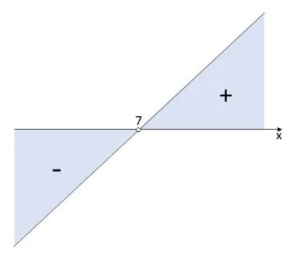

# Inequação do 1º Grau

## 1. Definição
- É uma expressão algébrica que possui um sinal de desigualdade (<, >, ≤, ≥) entre seus termos e o maior expoente da icógnita é igual a 1, sendo **a** e **b** números reais e **a** ≠ 0.
- Representação:
  - ax + b >0
  - ax + b < 0
  - ax + b ≥ 0
  - ax + b ≤ 0
- Exemplos:
  - x - 2 ≥ 5 é uma inequação na incógnita x.
  - 2t + 5 ≤ 4 é uma inequação na incógnita t.

#### Conjunto Solução
- A resolução de uma inequação é encontrar o conjunto de soluções que ao substituir a incógnita, produz uma sentença verdadeira.
- A representação do conjunto solução pode ser feita em forma de intervalo ou de forma geométrica.

Exemplo 1: Na inequação 2x + 3 > 11, com x ∈ R, temos:

1. 1 não é solução, pois 2 . 1 + 3 > 11 ⇔ 5 > 11 é uma afirmação falsa.
2. 5 é solução, pois 2 . 5 + 3 > 11 ⇔ 13 > 11 é uma afirmação verdadeira.
3. S: {x ∈ R | x ≥ 5} ou bolinha fechada no 5 indo ao infinito ou [5, +∞[ ou [5,+∞)

#### Propriedades e Regras de Resolução
- Soma e Subtração:
  - Adicionar ou subtrair o mesmo número (positivo ou negativo) de ambos os lados não altera o sinal da desigualdade.
  - Ex: x - 3 > 5 ⟶ x > 5 + 3 ⟶ x > 8  
- Multiplicação e Divisão (Positivo):
  - Multiplicar ou dividir ambos os lados por um número positivo mantém o sinal da desigualdade.
  - Ex: 2x < 10 ⟶ x < 10/2 ⟶ x < 5
- Inversão da Desigualdade (Negativo):
  - Multiplicar ou dividir ambos os lados por um número negativo inverte o sentido da desigualdade.
  - Ex: -2x ≤ 6 : (-2) ⟶ x ≥ 6/-2 ⟶ x ≥ -3
- Inversão de Lados:
  - Se **a** < **b**, então **b** > **a**

## 2. Resolução de uma Inequação do 1º Grau
- Para resolver uma inequação deve-se isolar a icógnita, contudo, deve-se ter cuidado quando a incógnita ficar negativa. Nesse caso, deve-se multiplicar por (-1) e inverter o símbolo da desigualdade.

Exemplo 1: Resolva a inequação 3x + 19 < 40.  

1. Para resolver a inequação devemos isolar o x, passando o 19 e o 3 para o outro lado da desigualdade.
2. Lembrando que ao mudar de lado devemos trocar a operação. Assim, o 19 que estava somando, passará diminuindo e o 3 que estava multiplicando passará dividindo.
3. 3x < 40 -19
4. x < 21/3
5. x < 7
6. Conclusão: Os valores que tornam a inequação verdadeira são todos números reais menores que 7.

Exemplo 2:  Um comerciante comprou um lote de um produto A por R$ 1 000,00 e outro, de um produto B, por R$ 3 000,00 e planeja vendê-los, durante um certo período de tempo, em kits contendo um item de cada produto, descartando o que não for vendido ao final do período. Cada kit é vendido ao preço de R$ 25,00, correspondendo a R$ 10,00 do produto A e R$ 15,00 do B. Tendo em vista essas condições, o número mínimo de kits que o comerciante precisa vender, para que o lucro obtido com o produto B seja maior do que com o A, é:  

1. x = número de kits vendidos
2. Lucro de A = 10x - 1000
3. Lucro de B = 15x - 3000
4. Lucro de B deve ser maior que o lucro de A: 15x - 3000 > 10x - 1000
5. Isolar x: 15x - 10x > 3000 - 1000 ⟶ 5x > 2000 ⟶ x > 2000/5 ⟶ x > 400
6. Nesse caso para que o lucro de B seja maior que o lucro de A deve-se vender mais de 400 kits, o número mínimo nesse caso é 401

> [!TIP] DICA: 
> - Também é possível descobrir o intervalo a partir da análise do gráfico da função do 1º correspondente. Para isso compara-se a expressão com a equação do 1º grau correspondente, trocando a desigualdade pela igualdade. Depois encontra-se a raíz da equação e monta-se o gráfico, analisando qual intervalo tem uma imagem que torna a desigualdade verdadeira.

Ex:  Dada a desigualdade 3x + 19 < 40, determinar o conjunto solução.

1. 3x + 19 < 40 ⟶ (bolinha aberta)
2. 3x + 19 - 40 = 0 ⟶ 3x - 21 = 0
3. Encontrar raíz: 3x - 21 = 0 ⟶ 3x = 21 ⟶ x = 21/3 = 7
4. Gráfico: o conjunto solução nesse caso são os valores menores que 7.

    

             

5.  S= {x ∈ R | x < 7} ou ]-∞ , 7[ ou (-∞ , 7)