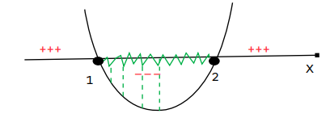

# Inequação do 1º Grau

## 1. Definição
- É uma expressão algébrica que possui um sinal de desigualdade (<, >, ≤, ≥) entre seus termos e o maior expoente da icógnita é igual a 2, sendo **a**, **b** e **c** números reais e **a** ≠ 0.
- Representação:
  - ax^2 + bx + c > 0
  - ax^2 + bx + c < 0
  - ax^2 + bx + c ≥ 0
  - ax^2 + bx + c ≤ 0

## 2. Resolução de uma Inequação do 2º Grau
- Resolver uma inequação significa determinar qual intervalo de valores que a incógnita pode assumir para satisfazer a expressão. Outra forma de resolver uma inequação do 2° grau é analisar o gráfico da função do 2° grau associada.

#### Processo
- 1º passo: Comparar a expressão com a equação do 2º grau correspondente.
- 2º passo: Obter as raízes da equação por meio de bhaskara ou pelas relações de girard.
- 3º passo: Atribuir valores para a incógnita com base nos intervalos de números reais determinados pelas raízes da equação e avaliar quais satisfazem a inequação. 
- 4º passo: Também é possível descobrir o intervalo a partir da análise do gráfico da função do 2º correspondente.  

Ex: Determine o conjunto solução da inequação do 2º grau x^2 - 4 < 0

1. Por ser uma equação incompleta é possível descobrir as raízes isolando a icógnita: x^2 - 4 = 0 ⟶ x^2 = 4 ⟶ x1 = -2 e x2 = 2
2. Agora vamos analisar o que ocorre na expressão x^2 = 4 para os números reais nos intervalos definidos por –2 e 2. Lembre-se de que buscamos valores de x, em que x^2 - 4 < 0
3. Se x < -2, tem-se que x^2 - 4 é maior que zero.
4. Se -2 < x < 2, tem-se que x^2 - 4 é menor que zero.
5. Se 2 < x, tem-se que x^2 - 4 é maior que zero.
6. S = { x ∈ R | -2 < x < 2}

> [!TIP] DICA: 
> - Se o sinal da inequação for maior ou maior igual, então o conjunto solução será formado pelo intervalo da imagem para valores em que **y** é positivo. Se o sinal for menor ou menor igual o conjunto solução será formado pelo intervalo da imagem para valores em que **y** é negativo.

Ex:  Dada a função f(x) = x2 – 3x + 2, determinar o conjunto solução para f(x) ≤ 0

1. 1x^2 -3x + 2 ≤ 0 ⟶ a=1 (bolinha fechada)
2. x^2 - 3x + 2 = 0
3. Δ = b2-4ac ⟶ -3^2 - 4 * 1 * 2 ⟶ 9 - 8 = 1
4. y = (3 +/- √1)/2 ⟶ (3 +/- 1)/2 
5. x1 = (3 + 1)/2 ⟶ 4/2 = 2
6. x2 = (3 - 1)/2 ⟶ 2/2 = 1
7. Raízes: 2 e 1
8. Gráfico: o conjunto solução é o intervalo em que os valores da imagem são negativos estando entre 1 e 2.

    

       

9.  S= {x ∈ R | 1 ≤ x ≤ 2} ou [1,2]