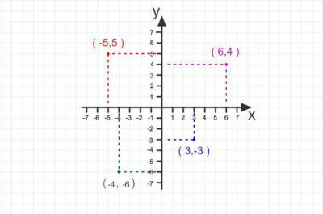
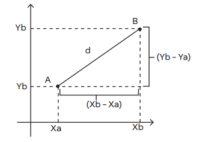

# Plano Cartesiano

## Definição
- O plano cartesiano é formado por duas retas reais perpendiculares, ou seja, o ângulo entre elas é de 90°.
- Essas retas determinam um único plano, que é denominado com sistema ortogonal de coordenadas cartesianas ou somente plano cartesiano.
- A origem do plano cartesiano é o zero. O plano possui esse nome em homenagem ao matemático René Descartes que sistematizou esse conhecimento.
- Sobre os eixos:
  - Eixo x (eixo horizontal chamado de eixo das abscissas).
  - Eixo y (eixo vertical chamado de eixo das ordenadas).
- Duas retas que se cruzam, formando 90°, irão dividir o plano em 4 quadrantes. A marcação dos quadrantes ocorre no sentido anti-horário.

#### Representação do Plano Cartesiano

 

    

           

#### Coordenadas de um ponto no Plano Cartesiano
- As coordenadas de um ponto no plano cartesiano, definem sua posição no plano cartesiano sendo definidas por pares ordenados.
- O primeiro valor representa a posição no eixo ***x**** e o segundo valor representa a posição no eixo ***y***.
- Representação:
  - A (xA, yA)

Ex: A (2, 4) e B (-1, 3)  

#### Distância entre 2 pontos
- Dados dois pontos quaisquer, A e B, de coordenadas (xA, yA) e (xB, yB), respectivamente, a distância entre os pontos A e B pode ser obtida da aplicação do teorema de Pitágoras.

 

    

           

d² = (XB - XA)² + (YB - YA)²  
d = √[(XB - XA)² + (YB - YA)²]  
d = dAB = √[(XB - XA)² + (YB - YA)²]  

##### Explicação:
1. O ponto d marca a distância entre A e B. 
2. É formado um triângulo retângulo com o fechamento da linha A. 
3. Será, então, aplicado o teorema de Pitágoras, que provou que a hipotenusa ao quadrado é igual a soma dos quadrados dos catetos. 
4. O que está marcado de azul é um quarteto que irá medir (xB – xA) e o segundo (yB- yA). Dito isso, será aplicada a fórmula acima.

Ex: Determinar a distância entre os pontos A (2, 1) e B (3, -4).  

1. Aplicando a fórmula, ficará o seguinte:
  - d = √[(XB - XA)² + (YB - YA)²]
  - d = √[(3 - 2)² + (-4 -1)²]
  - d = √[1² + (- 5)²]
  - d = √(1+25)
  - d = √26
2. Sem a fórmula, pode-se fazer da seguinte forma, levando em consideração que 1 e 5 correspondem aos 2 catetos:
  - d2 = 12 + 52
  - d2 = 26
  - d = √26
