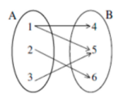

# Função

## Definição
- Função é uma relação entre variáveis, em que o valor de uma variável **y** vai depender do valor resultante da interação de uma variável **x** com a lei de formação da função (lei de que determina a relação entre as variáveis).

Ex: Um cabeleireiro cobra R$ 12,00 pelo corte com hora marcada e R$ 10,00 sem hora marcada. Ele tem por dia um número fixo de 6 clientes com hora marcada e um número variável X de clientes sem hora marcada.

1. O que é dado em função de que?
    - valor do dia = número de clientes . valor do corte 
    - O valor que o cabeleireiro recebe por dia, ou seja, sua receita, depende do número de clientes. Assim, a quantia recebida está em função do número de clientes atendidos.
2. Qual a fórmula que representa a quantia **Q** recebida por dia em função do número **x** de clientes?
    - y = x . 10 + 72
    - Q(x) = y
    - Q(x) = 10x + 72

> ### Representação das funções
- Dados dois conjuntos não vazios **A** e **B**, uma função f de A em B (escreve-se f: A → B) é uma relação que associa cada elemento **x** ∈ **A** a um único elemento **y** ∈ **B**.
- Representação:
  - f(x) = y
- Numa função f(x) = y, a letra **x** representa a variável independente e **y** a variável dependente.
- O domínio, o contradomínio e a imagem são conjuntos numéricos relacionados por funções matemática. Do conjunto domínio saem os valores que serão transformados pela fórmula da função, ou lei de formação. 
- Após, estes valores chegam no contradomínio. Ao subconjunto formado pelos elementos que chegam no contradomínio dá-se o nome de conjunto imagem.
- Em uma função f: A → B o conjunto **A** é chamado de domínio (D) e o conjunto **B** recebe o nome de contradomínio (CD). Um elemento de **B** relacionado a um elemento de **A** recebe o nome de imagem pela função. Agrupando todas as imagens de **B** temos um conjunto imagem, que é um subconjunto do contradomínio.

 

    

            

Ex: Dados os conjuntos A = {1, 2, 3, 4} e B = {5, 7, 8, 9, 10, 11, 12, 13, 14, 15}, determine a imagem da função f: A → B definida por f(x) = 2x + 3.

1. x = 1
   - f(x) = 2x + 3
   - f(1) = 2.1 + 3
   - f(1) = 5
2. x = 2
   - f(x) = 2x + 3
   - f(2) = 2.2 + 3
   - f(2) = 7
3. x = 3
   - f(x) = 2x + 3
   - f(3) = 2.3 + 3
   - f(3) = 9
4. x = 4
   - f(x) = 2x + 3
   - f(4) = 2.4 + 3
   - f(4) = 11
5. Im(f) = {5, 7, 9, 11}

**OBSERVAÇÃO:** Para que uma relação seja considerada uma função, é necessário que cada elemento do conjunto **x** esteja associado a um único elemento do conjunto **y**. Há uma forma práticade visualizar esse conceito, utilizando uma analogia entre filhos e pais. O conjunto à esquerda é denominado "filhos", e o conjunto à direita, "pais". Mesmo que dois filhos estejam associados ao mesmo pai, isso não configura um problema, pois a condição essencial é que cada filho tenha, no máximo, um pai.

Ex: É função.  

    

         

Ex: Não é função.

    

         

## Tipos de função

> ### Função sobrejetora
- Na função sobrejetora o contradomínio é igual ao conjunto imagem. Portanto, todo elemento de **B** é imagem de pelo menos um elemento de **A**.
- Representação: 
  - f: A → B, ocorre a Im(f) = B

> ### Função injetora
- Na função injetora todos os elementos de **A** possuem correspondentes distintos em **B** e nenhum dos elementos de **A** compartilham de uma mesma imagem em **B**. Entretanto, podem existir elementos em **B** que não estejam relacionados a nenhum elemento de **A**.

> ### Função bijetora
- Na função bijetora os conjuntos apresentam o mesmo número de elementos relacionados. 
- Essa função recebe esse nome por ser ao mesmo tempo injetora e sobrejetora.

> ### Função inversa
- Se uma função **f** leva os elementos de seu domínio **A** ao seu contradomínio **B**, a função inversa f-1 faz o caminho de volta, retornando os elementos de **B** para **A**.
- A função inversa f-1 é um tipo de função bijetora, ou seja, ela é sobrejetora e injetora em simultâneo.
- Representação: 
  - Dada f: A → B, ocorre f-1: B → A 

#### Método para escrever a função inversa
1. Para escrever a fórmula da função inversa de uma função bijetora, precisamos lembrar que f(x) = y.
2. Na função bijetora, substituir f(x) por "y".
3. Onde tem "x" troca-se por "y" e, onde tem "y" troca-se por "x".
4. Isola-se o "y" de um lado da igualdade.
5. Reescreve-se a função, substituindo y por f-1(x).

Ex: Escrever a função inversa da função bijetora f(x) = 2x + 3.
1. y = 2x + 3
2. x = 2y + 3
3. x – 3 = 2y => y = (x – 3)/2.
4. f-1(x) = (x – 3)/2.

> ### Função par
- Uma função é par quando f(-x) = f(x). Isto significa que o valor assumido pela função nos pontos **x** e **-x** são iguais. Desta forma, a função assume valores iguais para valores de **x** simétricos.

Exemplo: Função f: R → R definida por f(x) = x.

| x  | f(x)             | y |
|----|------------------|---|
| -3 | f(-3) = \| -3 \| | 3 |
| 0  | f(0) = \| 0 \|   | 0 |
| 3  | f(3) = \| 3 \|   | 3 |

**OBSERVAÇÃO:** Na função par o seu gráfico é simétrico em relação ao eixo **y**.

> ### Função ímpar
- Uma função é ímpar quando f(-x) = -f(x). Isto significa que os valores assumidos pela função serão simétricos tanto em relação ao eixo **x**, quanto em relação ao eixo **y**.

Exemplo: Função f: R → R definida por f(x) = x3
.

| x  | f(x)                     | y  |
|----|--------------------------|----|
| -1 | f(-1) = (-1)3 | -1 |
| 0  | f(0) = 03     | 0  |
| 1  | f(1) = 13     | 1  |

**OBSERVAÇÃO:** Na função é ímpar e seu gráfico é simétrico em relação à origem.

**OBSERVAÇÃO:** Existem funções que não são nem pares nem ímpares. Existe apenas uma função que é simultaneamente função par e ímpar que é f(x) = 0.

> ### Função composta
- A função composta, também chamada de função de função, é um tipo de função matemática que combina duas ou mais variáveis.
- Dada uma função f (f: A → B) e uma função g (g: B → C), a função composta de **g** com **f** é representada por **gof**. Já a função composta de **f** com **g** é representada por **fog**.
- A função **f** vai do domínio A ao contradomínio B.
- A função **g** vai do domínio B ao contradomínio C.
- Assim, o contradomínio da função **f** é o domínio da função **g**. Pode-se escrever uma função composta que liga diretamente o domínio A ao contradomínio C.
- Desta forma, a função que liga diretamente um elemento **x**, que pertença ao domínio A, ao contradomínio C é a função fog (x) ou, f(g(x)). Estas são duas maneiras de expressar a mesma função. 
- Assim, é válido que: **fog (x) = f(g(x))**
- Realizando o caminho inverso e saindo de C para A, temos: **gof (x) = g(f(x))**
- Nas funções compostas as operações entre as funções não são comutativas. Ou seja, **fog ≠ gof**

#### Como determinar função composta
- Para determinar uma função composta, aplica-se uma função no domínio da outra, substituindo a variável **x** pela lei da outra função.

Exemplo: Determine as funções compostas gof(x) e fog(x) das funções: f

1. (x) = 2x + 3
2. g(x) = 5x
3. gof(x)
4. g(f(x)) = g (2x + 3)
5. g(x) = 5x
6. g(2x + 3) = 5*(2x + 3)
7. g(f(x)) = 10x + 15
8. fog (x)
9. f(g(x)) = f(5x)
10. f(x) = 2x + 3
11. f(5x) = 2*(5x) + 3
12. f(g(x)) = 10x + 3