# Função do 1º grau ou função afim

## Definição
- Chama-se função polinomial do 1º grau, ou função afim, a qualquer função f de IR em IR dada por uma lei de formação f(x) = y = ax + b, onde a e b são números reais dados e a ≠ 0. No caso, o expoente do x em ax é = 1.
- Representação:
  - f(x) = ax + b
  - y = ax + b
- O gráfico de uma função polinomial do 1º grau, y = ax + b, com a ≠ 0, é uma reta oblíqua aos eixos Ox e Oy. Essa reta pode ser crescente ou decrescente.

 

    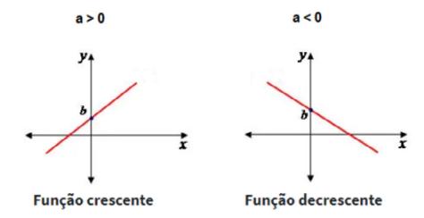

         

#### Pode-se afirmar que:
1. a: é o coeficiente angular da reta; e b: é o coeficiente linear.
2. Se a for positivo (a > 0), a função será crescente (Exemplo de função crescente: y = 2x + 5).
3. Se a for negativo (a < 0), a função será decrescente (Exemplo de função decrescente: y = -3 + 7).
4. O b é sempre o valor em que a reta tocará o eixo y.

Ex: O preço a ser pago por uma corrida de taxi inclui uma parcela fixa, denominada bandeirada, e uma parcela que depende da distância percorrida. Se a bandeirada custa R$ 5,00 e cada
quilômetro rodado custa R$ 2,40:

A) Expresse o valor P a ser pago em função da distância x (em quilômetros) percorrida.
1. P = 5 + 2,4 · x ou P(x) = 2,4x + 5

B) Calcule o preço de uma corrida de 7 km.
1. P(7) = 2,4 · 7 + 5
2. P(7) = 16,80 + 5
3. P(7) = 21,80

C) Calcule a distância percorrida por um passageiro que pagou R$ 29,00 pela corrida
1. 29 = 2,4x + 5
2. 29 - 5 = 2,4x
3. 24 = 2,4x
4. x = 10 km

> ### Valor numérico de uma função
- Para encontrar o valor numérico de qualquer função, conhecendo a sua lei de formação, basta realizarmos a substituição do valor de x para encontrar a imagem f(x).

Exemplo: Dada a função f(x) = x + 5, calcule:  
A) f(0)  
1. f(x) = x + 5  
2. f(0) = 0 + 5  
3. f (0) = 5  
4. Quando x for 0, o y será 5.  

B) f(1)  
1. f(x) = x + 5  
2. f(1) = 1 + 5  
3. f(1) = 6  

C) f(-2)  
1. f(x) = x + 5  
2. f(-2) = -2 + 5  
3. f(-2) = 3  

> ### Inclinação e coeficiente angular de uma reta
- O eixo x é o eixo das abscissas e o eixo y é o eixo das ordenadas.
- A reta r está formando com o eixo Ox um ângulo θ. A medida desse ângulo é feita em sentido anti-horário a partir de um ponto pertencente ao eixo Ox. 
- Assim, podemos dizer que a reta r tem inclinação θ e o seu coeficiente angular (a) igual a:
  - f(x) = y = ax + b  
  - a = tg θ  
- O coeficiente angular (a) é igual a tangente do ângulo formado entre a reta (r) e o eixo Ox.  
- Toda função do 1º grau corta o eixo y no termo independente de x (b).  
- A inclinação da reta irá variar entre 0º ≤ θ <180º. 

 

    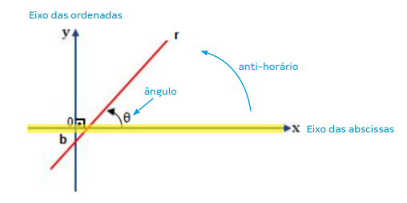

          

Exemplo 1:
 

    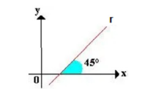

       

1. a = tg θ  
2. A reta r tem a lei de formação y = ax + b.  
3. Nesse exemplo, o valor da inclinação é menor que 90º.  
4. A inclinação é igual a 45º e o coeficiente angular é igual a: a = tg 45º = 1.  
5. Dessa forma: y = 1x + b ou y = x + b  

Exemplo 2:  
 

    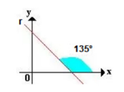

       

1. a = tg θ  
2. Nesse exemplo, o valor da inclinação da reta é maior que 90º e menor que 180º.  
3. A inclinação é igual a 135º e o coeficiente angular da reta é igual a: a = tg 135º = -1.  
4. Lei de formação: y = ax + b  
5. y = -x + b  

Exemplo 3:  
 

    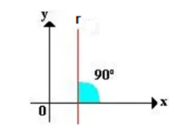

       

1. a = tg θ  
2. Quando a reta for paralela ao eixo Oy, ou seja, tiver uma inclinação igual a 90º o seu coeficiente angular não irá existir, pois não é possível calcular a tg 90º.
3. A tg nasce da divisão entre seno e cosseno. O cosseno de 90º é 0 e não existe divisão por 0. Também não é possível calcular a tg de 270º.  

Exemplo 4:  
 

    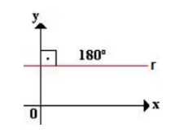

       

1. a = tg θ
2. Nesse exemplo a reta r é paralela ao eixo Ox, ou seja, seu ângulo de inclinação é igual a 180º, portanto, o seu coeficiente angular será igual a: a = tg 180º = 0.
3. Lei de formação da reta r: y = ax + b  
4. y = b  

> ### Função constante
- A função constante é quando uma função é constituída por um só número que é racional. 
- A forma canônica desta função é igual: f(x) = b.
- Se o valor de b for positivo, ele estará acima do eixo x; se for igual a 0, estará sobre o eixo x; e se for menor que 0, estará abaixo do eixo x.

 

    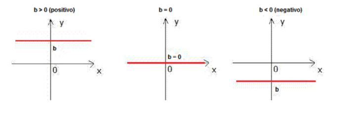

         

> ### Função linear e função identidade
- A função linear é uma função f: ℝ→ℝ definida como f(x) = a.x, sendo a um número real e diferente de zero. 
- Esta função é um caso particular da função afim f(x) = a.x + b, quando b = 0.
- Quando o valor de a for igual a 1, a função linear será também chamada de função identidade. A função identidade é também nomeada de função inclusão.

 

    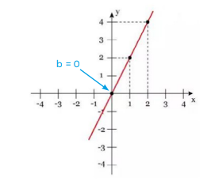

          

 

    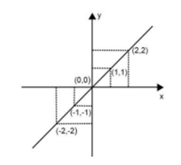

          

1. O gráfico é chamado de bissetriz dos quadrantes ímpares (1º e 3º), uma vez que a reta separa o ângulo em dois de mesmo tamanho (45º).

> ### Representação gráfica da reta
- Para construir o gráfico da reta conhecendo a sua equação, encontramos dois pontos pertencentes a essa reta e traçamos a reta que passa por esses dois pontos.

Exemplo:   
A) Encontre o gráfico da reta y = 2x - 1
1. a = 2
2. b = -1
3. Como a > 0, a função será crescente.
4. No eixo y, a reta tocará no ponto -1.

 

    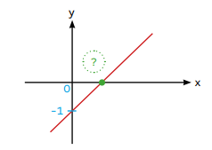

       

B) Para determinar a raiz da função, ou seja, o valor em que a reta interceptará o eixo x, representado pela interrogação, é preciso igualar o y a 0 na função y = 2x - 1:
1. y = 2x - 1
2. 0 = 2x - 1
3. 1 = 2x
4. 1/2 = x
5. O gráfico da reta é:

 

    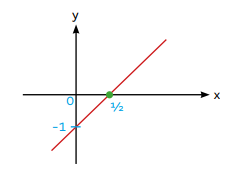

       