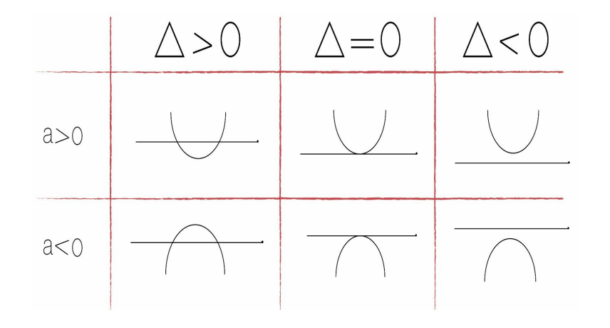

# Função do 2° Grau

## Definição
- É toda função f de R em R, definida por f(x) = ax2 + bx + c onde a, b e c são números reais e a≠ 0.
- Representação:
  - f(x) = ax2 + bx + c
- A função do 2° grau também é chamada de função quadrática.
- Na função do 2°, o seu gráfico é formado por parábolas.

> ### Elementos do gráfico da função do 2° grau
- O gráfico de uma função quadrática é uma parábola que será côncava para cima, se a for positivo (a > 0) ou côncava para baixo, se a for negativo (a < 0).
- O valor de **a** ajuda a definir algo importante: quando a for maior do que zero, a concavidade será para cima; e quando a for menor do que zero, a concavidade será para baixo.
- **c** é o ponto onde a parábola intercepta o eixo y. A interseção é dada pelo ponto (0; f(0)); O valor de c é o mesmo ponto de b na função do 1º grau. Se for cortado em 10, o c valerá 10; se cortar em 20, o c valerá 20. A interseção é dada por (0; f(0)).
- As raízes ou zeros da função são as interseções com o eixo das abscissas. A raiz é onde a parábola cruza o eixo x.
- O vértice cujas coordenadas são: xv = -b/2a e yv = -∆/4a
- Esta é a fórmula para se encontrar o x do vértice. O x do vértice (Xv) também pode ser a média aritmética das raízes. O vértice é o ponto mais baixo de uma parábola ou, por vezes,
pode ser o ponto mais alto de uma parábola. Se a concavidade estiver para cima, o vértice é o ponto mais baixo; se a concavidade estiver para baixo, o vértice é o ponto mais alto.
- O vértice será muito cobrado nas questões de concurso público, pois, quando o examinador perguntar "qual é o lucro máximo?", aplica-se o vértice; para calcular a altura máxima da
bola, também aplica-se o vértice. O eixo de simetria deixa a parábola simétrica em relação ao vértice. Para encontrar o x do vértice, pode-se utilizar a fórmula ou então calcular a média.
- O Xv  é a média aritmética das raízes.
- Yv é o valor máximo, se a < 0.
- Yv é o valor mínimo, se a > 0.

#### Concavidade do gráfico da função do 2° grau
 

    

           

#### Gráfico da função do 2° grau

 

    

           

#### Posições do gráfico da função do 2° grau

 

    

           

**OBSERVAÇÃO:** Quando a é maior do que zero, a concavidade está para cima; por essa razão, na primeira linha estão os gráficos todos voltados para cima. Quando a é menor do que zero,
a concavidade está para baixo; por essa razão, na segunda linha, os gráficos estão todos voltados para baixo.

**OBSERVAÇÃO:** Quando ∆ for maior do que zero, encontram-se duas raízes reais e distintas; por essa razão, a parábola toca o eixo x duas vezes. Quando ∆ for igual a zero, encontra-se somente uma raiz dupla; por essa razão, a parábola toca apenas uma vez no eixo x. Quando ∆ for menor do que zero, não existem raízes reais; por essa razão, a parábola não toca o eixo x. 

Ex: Considere a função quadrática de R em R, dada por y = f(x) = x2 -6x + 8

A) Encontre seu vértice, seu mínimo (ou máximo) e seu conjunto imagem.
1. O vértice tem o Xv = - b/2ª = -(-6)/2.1 = 6/2 = 3
2. O Yv = -∆/4a ou f(3) = 32 - 6 . 3 + 8
3. f(3) = 9 - 18 + 8
4. f(3) = -1
5. O vértice é 3 em x e -1 em y v(3,-1)
6. O mínimo dessa função é -1
7. A imagem da função vai de -1 até o + infinito ou y E/R/y ≥-1

B) Encontre suas raízes
1. A raiz é onde o y = 0
2. x2 – 6x + 8 = 0
3. ∆ = b2 – 4ac
4. ∆ = 6 . 6 - 4 . 1 . 8
5. ∆ = 36 - 32 = 4
6. x = -b ± √∆/2a
7. x = -(-6) ± √4/2 . 1
8. x = 6 ± √4/2
9. x = 6 ± 2/2
10. x1 = 6 + 2/2 = 8/2 = 4
11. x2 6 - 2/2 = 4/2 = 2
12. Raízes = (4, 2) 

> ### Forma fatorada da função
- A lei de uma função quadrática definida por f(x) = ax2 + bx + c também pode ser escrita na forma fatorada.
- Representação:
  - f(x) = a . (x - m) . (x - n)
  - sendo m e n as raízes de f.
- Para obter as raízes de f, basta obter os valores de x para os quais f(x) = 0.

