# Função do 2° Grau

## Definição
- Uma função do 2º grau é definida pela lei de formação y = f(x) = ax² + bx + c, onde a, b e c são números reais e a ≠ 0. A função do 2° grau também é chamada de função quadrática.
- Além da lei de formação, essa função possui domínio e contradomínio no conjunto dos números reais, ou seja, f: R→ R.
- Representação:
  - f(x) = ax2 + bx + c

Exemplos:  
A) f(x) = 2x²+5x + 1 (a = 2, b = 5, c = 1)  
B) g(x) = -x² + 9 (a = -1, b = 0, c = 9)  
C) h(x) = x² – x (a = 1, b = -1, c = 0)  

> ### Valor numérico de uma função
- Para encontrar o valor numérico de qualquer função, conhecendo a sua lei de formação, basta realizar a substituição do valor de x para encontrar a imagem f(x).

Ex: Dada a função f(x) = x² + 2x – 3, calcule:

A) f(0): 
1. f(o) = 0²+2.(0) -3
2. f(o) = 0+0-3
3. f(o) = -3  

B) f(1): 
1. f(1) = 1²+2(1)-3
2. f(1) = 1 + 2 - 3
3. f(1)= 0

C) f(2): 
1. f(2) = 2² + 2(2) – 3
2. f(2) = 4 + 4 – 3
3. f(2) = 5 

> ### Raízes da função do 2° grau
- As raízes ou zeros da função são as interseções com o eixo das abscissas. A raiz é onde a parábola cruza o eixo x.
- Para encontrar as raízes da função quadrática, conhecidas também como zero da função, é necessário o domínio das equações do segundo grau. Para resolver uma equação do segundo grau, há vários métodos, como a fórmula de Bhaskara e as relações de Girard (soma e produto).
- As raízes de uma função quadrática são os valores de x que fazem com que f(x) = 0. Sendo assim, para encontrar as raízes de uma equação do 2º grau, faremos ax² + bx + c = 0. Dessa forma, compreende-se que para encontrar as raízes é necessário transformar a função de 2º grau em equação de 2º grau.

Exemplo: f(x) = x² -5x + 6  
1. x² -5x + 6 = 0
2. Aplicando a fórmula de Bháskara: x = −𝑏± 𝑏 2−4𝑎𝑐2𝑎 ou as relações de Girard (soma
e produto) encontramos as raízes da função dada. 
1. Então, os zeros da função são {2, 3}

Ex: Considere a função quadrática de R em R, dada por y = f(x) = x2 -6x + 8, encontre suas raízes.
1. A raiz é onde o y = 0
2. x2 – 6x + 8 = 0
3. ∆ = b2 – 4ac
4. ∆ = 6 . 6 - 4 . 1 . 8
5. ∆ = 36 - 32 = 4
6. x = -b ± √∆/2a
7. x = -(-6) ± √4/2 . 1
8. x = 6 ± √4/2
9. x = 6 ± 2/2
10. x1 = 6 + 2/2 = 8/2 = 4
11. x2 6 - 2/2 = 4/2 = 2
12. Raízes = (4, 2) 

> ### Gráfico da função do 2° grau
- A representação gráfica da função de segundo grau é uma parábola. O formato da função de 2º grau é: f(x) = ax² + bx + c, sendo o **a** o responsável por
definir a direção da concavidade da parábola (com a boca para cima ou para baixo). Quando a for maior do que zero, a concavidade será para cima; e quando a for menor do que zero, a concavidade será para baixo.
- Quando a parábola chega no "ponto de cela", isto é, no vértice da parábola, a mesma passa a ser crescente ou decrescente.
- Esse vértice também é chamado de "ponto mínimo" ou "ponto máximo" da função. Sendo positivo ou negativo, o **a** sempre tocará um único ponto, que é o vértice.
- A parábola apresenta alguns elementos essenciais: as raízes (pontos onde o gráfico intercepta o eixo x) e o vértice (ponto de máximo ou mínimo da função).
- A quantidade de raízes reais de uma função quadrática depende do valor obtido para o radicando Δ = b 2 – 4.a.c, chamado Discriminante.

 

    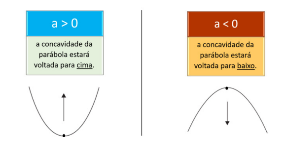

          

#### Estudo do discriminante e sua relação entre as raízes
- O parâmetro Δ (delta) é também chamado de discriminante, porque é seu valor que discrimina, distingue, o tipo de raízes que a função quadrática terá. Ou seja, dependendo
do valor de Δ, há diferentes tipos de raízes
- Tipos de raízes:
  - ∆ > 0 (A equação possui duas raízes reais e diferentes)
  - ∆ = 0 (A equação possui duas raízes reais e iguais)
  - ∆ < 0 (A equação não possui raízes reais)

 

    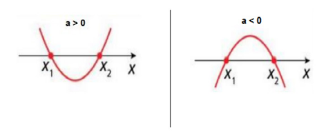

        

 

    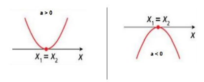

        

 

    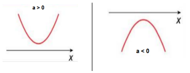

        

#### Estudo das posições do gráfico da função do 2° grau
- Quando **a** é maior do que zero, a concavidade está para cima; por essa razão, na primeira linha estão os gráficos todos voltados para cima. Quando **a** é menor do que zero,
a concavidade está para baixo; por essa razão, na segunda linha, os gráficos estão todos voltados para baixo.
- Quando ∆ for maior do que zero, encontram-se duas raízes reais e distintas; por essa razão, a parábola toca o eixo x duas vezes. Quando ∆ for igual a zero, encontra-se somente uma raiz dupla; por essa razão, a parábola toca apenas uma vez no eixo x. Quando ∆ for menor do que zero, não existem raízes reais; por essa razão, a parábola não toca o eixo x. 

 

    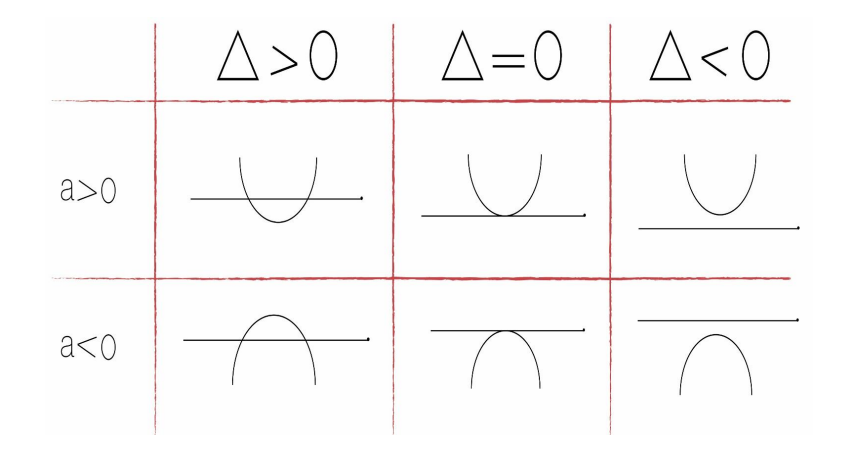

          

#### Estudo dos coeficientes b e c
- Os coeficientes da equação são elementos que interferem na construção do gráfico. O coeficiente **a**, determina a concavidade da parábola. Enquanto o coeficiente **c** indica onde a parábola corta o eixo **Y**.
- Esses coeficientes estabelecem as seguintes relações:
  - Se c > 0, a parábola irá cortar o eixo Y acima da origem.
  
   
  

      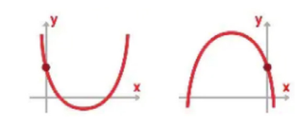
  
        
  
  - Se c < 0, a parábola irá cortar o eixo Y abaixo da origem. Sendo menor do que 0 irá ser cortado abaixo da origem.
  
   
  

      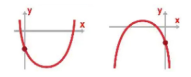
  
        

  - Se c = 0, a parábola irá cortar o eixo Y na origem, ou seja, ponto (0,0). Sendo igual a 0, a parábola será cortada justamente na origem.
  
   
  

      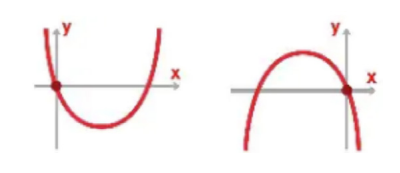
  
        

- Já o coeficiente **b** determina a inclinação da parábola após passar o eixo y, estabelecendo as seguintes relações:
  - Se b > 0, a parábola intercepta o eixo Y no ramo crescente. Sendo positivo, o eixo será interceptado no ramo crescente.

   
  

      
  
        
  
  - Se b < 0, a parábola intercepta o eixo Y no ramo decrescente.
  
   
  

      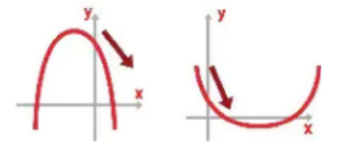
  
        

- Da mesma forma, pode-se traçar o vértice que marca o momento que o crescimento é alterado pelo ramo decrescente:
  - Se b = 0, a parábola intercepta o eixo Y no vértice.
  
   
  

      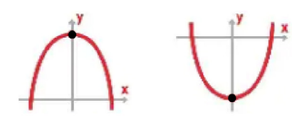
  
        

#### Ponto máximo e ponto mínimo de uma função do 2º grau.
- No estudo da função do 2º grau, percebemos que seu gráfico é uma parábola e que esse gráfico apresenta pontos notáveis e de bastante aplicação na vida cotidiana e no
estudo de outras ciências. Esses pontos são: as raízes da função e o vértice da parábola.
- As raízes determinam quais os pontos onde o gráfico intercepta o eixo das abscissas (eixo x); o vértice pode ser o ponto de máximo absoluto ou de mínimo absoluto da função, ou
seja, o maior ou o menor valor que a função pode assumir em todo o seu domínio.
- O ponto de máximo e o ponto de mínimo de uma função do 2º grau são definidos pela concavidade da parábola, se está voltada para baixo ou para cima.
- Quando o coeficiente **a** for negativo, a concavidade da parábola estará para baixo. Nesse caso, o vértice será o máximo valor atingido pela função. O maior valor assumido é o ponto do vértice. O gráfico com a boca para baixo apresenta esse valor máximo.
    
  

      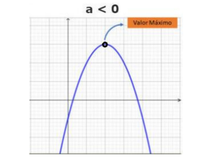
  
          

- Quando o coeficiente **a** for positivo, a concavidade estará voltada para cima, e o vértice representará o mínimo valor da função. No caso do coeficiente positivo, a concavidade é voltada para cima e o vértice é oposto ao caso anterior, apresentando o menor valor que a função assumirá.
    
  

      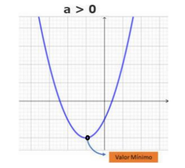
  
          

- Para determinar o ponto máximo e o ponto mínimo de uma função do 2º grau, basta calcular o vértice da parábola. As coordenadas de Vértice são:
    
  

      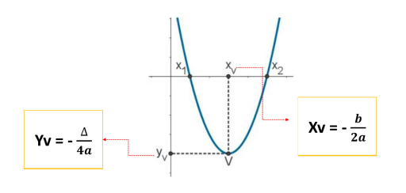
  
          

- O vértice é um ponto pertencente à parábola e, por ser um ponto especial, possui uma abscissa chamada de "x do vértice", bem como o eixo y é chamado de "y do vértice".
- Esse ponto do vértice apresenta uma coordenada x e uma coordenada y, sendo que qualquer ponto dentro do plano cartesiano será definido por um par ordenado.
- Em especial, o vértice tem como calcular tais pontos através de fórmulas, que estão sendo apresentadas no plano acima. 

Exemplo: Encontre as coordenadas do vértice da função f(x) = - x² + 4x - 2.
1. Definindo os coeficientes:a = -1, b = 4, c = -2
2. Aplicando a fórmula:
3. Xv = (-b)/2a = (-4)/[2(-1)] = (- 4)/(- 2) = 2
4. Yv = (-∆)/4a
5. No caso do Y do vértice, é preciso encontrar o valor do delta:
6. ∆ =b² - 4ac
7. ∆ =4² - 4(-1)(-2)
8. ∆ = 16 - 8
9.  = 8
10. Sabendo o valor de delta, pode-se prosseguir para encontrar o valor do Y do vértice:
11. Yv = (-∆)/4a = (- 8)/[4(-1)] = (- 8)/(- 4) = 2
12. Dessa forma, as coordenadas do vértice, neste caso, são: 2/Xv e 2/Yv

Exemplo: O lucro de uma fábrica na venda de determinado produto é dado pela função L(x) = – 5x² + 100x – 80, onde x representa o número de produtos vendidos e L(x) é o lucro em
reais. Determine:

A) O lucro máximo obtido pela fábrica na venda desses produtos.  
1. L(x) = -5x² + 100x - 80
2. Só de observar, nota-se que o coeficiente **a** é negativo. Logo, a boca da parábola será voltada para baixo e o **c** cortará abaixo do eixo x. O coeficiente **b**, sendo positivo, cortará em um ângulo crescente.

 

    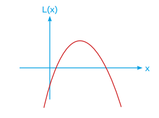

          

3. Se o objetivo é saber o lucro, deve-se colocar em lugar do **x** as quantidades dos produtos vendidos. A venda de 10 produtos, por exemplo, pode substituir o **x** do coeficiente **a** para calcular o lucro. No caso do maior lucro possível, deve-se reconhecer o valor do vértice. Em outras palavras, faz-se necessário o cálculo do Y do vértice.
4. Yv = (-∆)/4a
5. Encontrando o valor de delta:
6. ∆ = b² - 4ac
7.  = (100)² - 4(-5)(-80)
8. ∆ = 8400
9.  Yv = (-8400)/[4(-5)] = 420

B) Quantos produtos precisam ser vendidos para obtenção do lucro máximo.  
1. Xv = (-b)/2a
2. y = -5x² + 100x - 80
3. Xv = -100/[2(-5)] = -100/(-10) = 10
4. Dessa forma, fazem-se necessários 10 produtos para obter o maior lucro possível.

#### Imagem da função
- Como o vértice representa o ponto máximo ou mínimo da função do 2º grau, ele é usado para definir o conjunto imagem dessa função, ou seja, os valores de y que pertencem à função.
- Dessa forma, existem duas possibilidades para o conjunto imagem da função quadrática:
  - Para a > 0, o conjunto imagem será:
    
  

      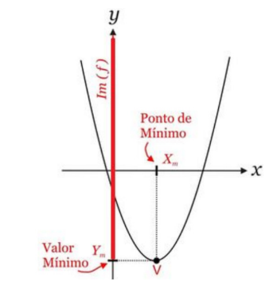
  
             

  - Perceba que a imagem é a reflexão. Analisando o eixo Y, percebe-se que a imagem começa no vértice e vai subindo.
  - No caso da concavidade voltada para cima, tem-se:Imagem = {y Є R / y ≥ Yv}
  - Para a < 0, o conjunto imagem será:
    
  

      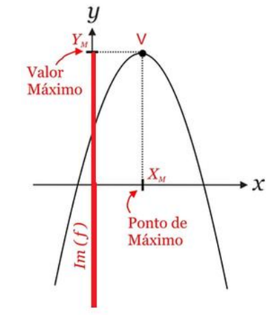
  
             

  - Nesse caso, a imagem está com a concavidade voltada para baixo.
  - Com isso, o conjunto imagem é definido da seguinte forma: Imagem = {Y Є R / y ≤ Yv).
  - Lembrando que, nesse caso, o vértice corresponde ao ponto máximo da função.

Exemplo: Definir a imagem da função f(x) = x2 + 2 x – 3.
1. Nos dois casos anteriores, necessitou-se do Y do vértice. Portanto, define-se o mesmo como: Yv = (-∆)/4a
2. Encontrando o delta:
3. ∆ = b² - 4ac
4. ∆ = 2² - 4(1)(-3)
5. ∆ = 4 + 12
6. ∆ = 16
7. Outro detalhe é que o gráfico terá a boca voltada para cima, pois **a** é positivo.

 

    

          

8. A representação será próxima ao exemplo acima. Tudo o que estiver acima do valor Yv = - 4 será considerado como imagem.
9. Logo, o conjunto imagem será: Im = {y ∊ R/≥ - 4}.

> ### Forma fatorada da função
- A lei de uma função quadrática definida por f(x) = ax2 + bx + c também pode ser escrita na forma fatorada.
- Representação:
  - f(x) = a . (x - m) . (x - n)
  - sendo m e n as raízes de f.
- Para obter as raízes de f, basta obter os valores de x para os quais f(x) = 0.

