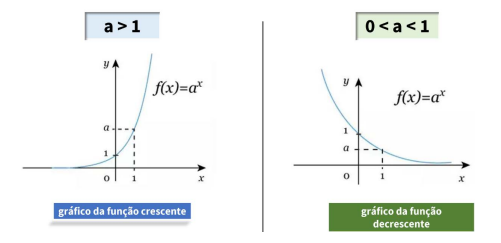
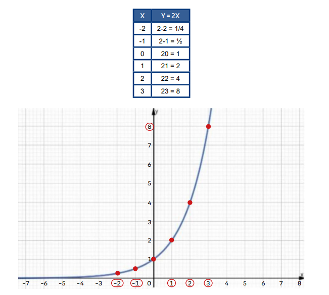
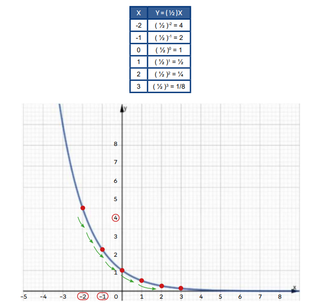

# Função do 2° Grau

## Definição
- Função Exponencial é aquela que a variável está no expoente e cuja base é sempre maior que zero e diferente de um. Tal função, é explicitada da seguinte forma: f: R -> R
tal que y = ax, sendo que a > 0 e a ≠ 1.
- Representação: 
  - y = ax
- Observa-se que **a** corresponde à base da função exponencial. Essas restrições são necessárias, pois 1 elevado a qualquer número resulta em 1. Assim, em vez de exponencial, estaríamos diante de uma função constante.

Exemplos:  
A) f(x) = 4x  
B) f(x) = (0,1)x  
C) f(x) = (⅔)x  

> ### Gráfico da função exponencial
- O gráfico desta função passa pelo ponto (0,1), pois todo número elevado a zero é igual a 1. 
- Além disso, a curva exponencial não toca no eixo x.
- Na função exponencial, a base é sempre maior que zero, portanto, a função terá sempre imagem positiva. Assim sendo, não apresenta pontos nos quadrantes III e IV
(imagem negativa).
- A função exponencial pode ser crescente ou decrescente.
- Será crescente quando a base for maior que 1.
- Será decrescente quando a base for maior que zero e menor do que 1.

 

    

           

Ex: y = 2x   

 

    

                     

Ex: y = ( ½ )x    

 

    

                     

Ex: Dada a função f(x) = 2x+3+ 10, o valor de x para que f(x) = 42 é?  
1. 42 = 2(x+3) + 10
2. 42 -10 = 2(x+3)
3. 32 = 2(x+3)
4. 25 = 2(x+3)
5. 5 = x + 3
6. 5 - 3 = x
7. x = 2.