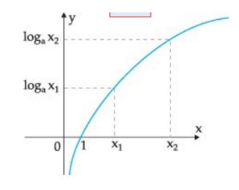
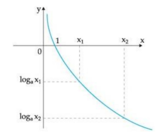
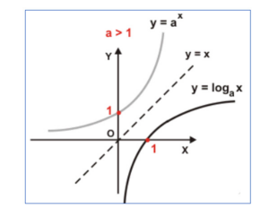
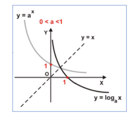

# Função do Logarítmica

## Definição
- A função logarítmica é dada pela lei de formação f(x) = loga x, na qual **a** é a base positiva (a > 0) e sempre diferente de 1. 
- Nesse tipo de função, o logaritmo de base **a**, ligado a determinado valor de **b**, tem o expoente igual a **x**, que é a potência da base que resulta justamente em **b**. 
- Representação:
  - logab = x
  - a = base
  - b = logaritmando
  - x = logaritmo
  - logab = x ↔ ax = b

Ex: log28 = x ↔ 2x = 8
1. O resultado 2x = 8 será a equação a ser resolvida.
2. 2x = 8
3. 2x = 23
4. x = 3

Exemplos:  
A) f(x) = logax  
B) f(x) = log2(x - 4)  
C) f(x) = logx  

#### Propriedades da função logarítmica
- D (f) = R+*
- Im (f) = R
- f(x) não é par, nem ímpar.
- f(x) não é limitada.
- A função logarítmica é classificada como função injetora.
- A imagem da função são todos os valores que são refletidos quando colocados na lei de formação e verifica-se o resultado. Além disso, na função injetora, tem-se diferentes
valores, diferentes do domínio e, consequentemente, diferentes imagens.

> ### Domínio da Função Logarítmica
- A função logarítmica é definida pela formação f(x) = loga, sendo 0 < a ≠ 1. Isso remete a uma função f: R+* --->R, ou seja, o domínio integra o conjunto dos números reais
positivos, excluindo o zero. (R+*).
- A expressão R+* representa o domínio da expressão, enquanto o R concebe o contradomínio. Além disso, o valor necessita ser positivo e não pode ser 0, sendo o * a expressão do valor 0.
- É o domínio da função que delimita os valores aplicados em **x** para os cálculos do f(x), que na matemática é chamado de imagem. No caso da função logarítmica, a situação de existência depende do sinal positivo de **x** e a necessidade de a base também ser positiva, mas diferente de 1.

Ex: Determine o domínio da função logarítmica f(x) = log (x - 2).  
1. Temos as seguintes restrições para o logaritmando e a base: Logaritmando: x - 2 > 0 → x > 2, Base: 10 > 0.
2. Como o valor precisa ser maior que 0, isso significa que para a função existir, o "x" não pode ser qualquer valor, pois o valor precisa ser mais que 1, sendo essa a condição
de existência.
3. Portanto, o domínio dessa função é D = {x ∈ R | x > 2}.

> ### Gráfico da Função Logarítmica
- O gráfico da função logarítmica é uma curva, construída em razão dos valores aplicados em **x** e os respectivos resultados calculados para f(x).
- As coordenadas são colocadas dentro do plano cartesiano nos quadrantes I e II, pois essa função é caracterizada por x > 0. Além disso, a depender da base **a**, são classificadas em crescente e decrescente.

#### A base do logaritmo é um número real maior que 1
- Função crescente: f(x) = loga x – a < 1:

 

    

           

- Observe que, à medida que x aumenta, acontece o mesmo com a imagem (x2 > x1 <--> loga x1), portanto, é uma curva que cresce em virtude do aumento de x.
- O aumento caracterizado pela análise gráfica foi visivelmente crescendo. Para essa identificação, basta verificar a base do logaritmo e, se ela se enquadrar em maior que, o resultado gráfico será crescente.

#### A base do logaritmo apresenta um valor real entre 0 e 1
- Função decrescente: f(x) = logax – 0 < a < 1:

 

    

           

- Observe que à medida que x aumenta, a imagem diminui (x2 > x1 <--> logax2), portanto, é uma curva que decresce em virtude do aumento de x.
- Ao observar o gráfico, percebe-se que conforme o "x", menor o gráfico fica. Assim, tem-se uma curva que decresce em virtude do aumento de "x".

> ### Estudo da variação da função logarítmica
- A função logarítmica é inversa da função exponencial e, portanto, o seu gráfico é simétrico do gráfico da função exponencial em relação à reta y = x, sendo representada
graficamente por:

 

    

           

- A simetria é perfeita, por isso é inversa uma da outra.

 

    

           

- Quando traçada a reta, a simetria é verificada em conjunto com a função exponencial.

