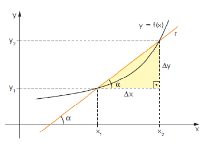
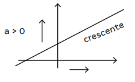
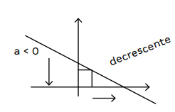

# Função do 1° Grau

## Definição
- É toda função f de R em R definida por f(x) = ax + b ou y = ax + b, em que a e b são números reais e a ≠ 0.
- Representação:
  - f(x) = ax + b
- A função do 1º grau também é chamada de função afim.

Ex: O preço a ser pago por uma corrida de taxi inclui uma parcela fixa, denominada bandeirada, e uma parcela que depende da distância percorrida. Se a bandeirada custa R$ 5,00 e cada
quilômetro rodado custa R$ 2,40:

A) Expresse o valor P a ser pago em função da distância x (em quilômetros) percorrida.
1. P = 5 + 2,4 · x ou P(x) = 2,4x + 5

B) Calcule o preço de uma corrida de 7 km.
1. P(7) = 2,4 · 7 + 5
2. P(7) = 16,80 + 5
3. P(7) = 21,80

C) Calcule a distância percorrida por um passageiro que pagou R$ 29,00 pela corrida
1. 29 = 2,4x + 5
2. 29 - 5 = 2,4x
3. 24 = 2,4x
4. x = 10 km

> ### Elementos do gráfico da função do 1° grau
- Se a = 0, não é uma função.
- a = coeficiente angular (define a inclinação da reta ou taxa de variação).
- b = coeficiente linear (é o ponto onde a reta intercepta o eixo y).
- Funções de 1º grau são retas com aclividade.

 

    

           

#### Função crescente
- Quando **a > 0** a reta será ascendente e a função crescente.

 

    

       

#### Função decrescente
- Quando **a < 0** a reta será descendente e a função decrescente.

 

    

       