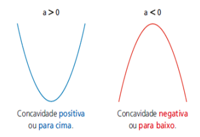
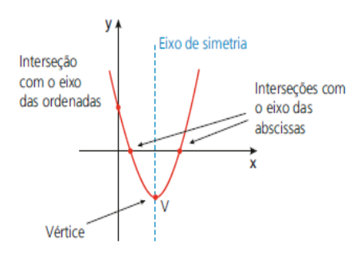

# Função do 2° Grau

## Definição
- Uma função do 2º grau é definida pela lei de formação y = f(x) = ax² + bx + c, onde a, b e c são números reais e a ≠ 0. A função do 2° grau também é chamada de função quadrática.
- Além da lei de formação, essa função possui domínio e contradomínio no conjunto dos números reais, ou seja, f: R→ R.
- Representação:
  - f(x) = ax2 + bx + c

Exemplos:  
A) f(x) = 2x²+5x + 1 (a = 2, b = 5, c = 1)  
B) g(x) = -x² + 9 (a = -1, b = 0, c = 9)  
C) h(x) = x² – x (a = 1, b = -1, c = 0)  

> ### Valor numérico de uma função
- Para encontrar o valor numérico de qualquer função, conhecendo a sua lei de formação, basta realizar a substituição do valor de x para encontrar a imagem f(x).

Ex: Dada a função f(x) = x² + 2x – 3, calcule:

A) f(0): 
1. f(o) = 0²+2.(0) -3
2. f(o) = 0+0-3
3. f(o) = -3  

B) f(1): 
1. f(1) = 1²+2(1)-3
2. f(1) = 1 + 2 - 3
3. f(1)= 0

C) f(2): 
1. f(2) = 2² + 2(2) – 3
2. f(2) = 4 + 4 – 3
3. f(2) = 5 

> ### Raízes da função do 2° grau
- As raízes ou zeros da função são as interseções com o eixo das abscissas. A raiz é onde a parábola cruza o eixo x.
- Para encontrar as raízes da função quadrática, conhecidas também como zero da função, é necessário o domínio das equações do segundo grau. Para resolver uma equação do segundo grau, há vários métodos, como a fórmula de Bhaskara e as relações de Girard (soma e produto).
- As raízes de uma função quadrática são os valores de x que fazem com que f(x) = 0. Sendo assim, para encontrar as raízes de uma equação do 2º grau, faremos ax² + bx + c = 0. Dessa forma, compreende-se que para encontrar as raízes é necessário transformar a função de 2º grau em equação de 2º grau.

Exemplo: f(x) = x² -5x + 6  
1. x² -5x + 6 = 0
2. Aplicando a fórmula de Bháskara: x = −𝑏± 𝑏 2−4𝑎𝑐2𝑎 ou as relações de Girard (soma
e produto) encontramos as raízes da função dada. 
1. Então, os zeros da função são {2, 3}

Ex: Considere a função quadrática de R em R, dada por y = f(x) = x2 -6x + 8, encontre suas raízes.
1. A raiz é onde o y = 0
2. x2 – 6x + 8 = 0
3. ∆ = b2 – 4ac
4. ∆ = 6 . 6 - 4 . 1 . 8
5. ∆ = 36 - 32 = 4
6. x = -b ± √∆/2a
7. x = -(-6) ± √4/2 . 1
8. x = 6 ± √4/2
9. x = 6 ± 2/2
10. x1 = 6 + 2/2 = 8/2 = 4
11. x2 6 - 2/2 = 4/2 = 2
12. Raízes = (4, 2) 

> ### Gráfico da função do 2° grau
- A representação gráfica da função de segundo grau é uma parábola. O formato da função de 2º grau é: f(x) = ax² + bx + c, sendo o **a** o responsável por
definir a direção da concavidade da parábola (com a boca para cima ou para baixo). Quando a for maior do que zero, a concavidade será para cima; e quando a for menor do que zero, a concavidade será para baixo.
- Quando a parábola chega no "ponto de cela", isto é, no vértice da parábola, a mesma passa a ser crescente ou decrescente.
- Esse vértice também é chamado de "ponto mínimo" ou "ponto máximo" da função. Sendo positivo ou negativo, o **a** sempre tocará um único ponto, que é o vértice.
- A parábola apresenta alguns elementos essenciais: as raízes (pontos onde o gráfico intercepta o eixo x) e o vértice (ponto de máximo ou mínimo da função).
- A quantidade de raízes reais de uma função quadrática depende do valor obtido para o radicando Δ = b 2 – 4.a.c, chamado Discriminante.

 

    

          

#### Estudo do discriminante e sua relação entre as raízes
- O parâmetro Δ (delta) é também chamado de discriminante, porque é seu valor que discrimina, distingue, o tipo de raízes que a função quadrática terá. Ou seja, dependendo
do valor de Δ, há diferentes tipos de raízes
- Tipos de raízes:
  - ∆ > 0 (A equação possui duas raízes reais e diferentes)
  - ∆ = 0 (A equação possui duas raízes reais e iguais)
  - ∆ < 0 (A equação não possui raízes reais)

 

    

        

 

    

        

 

    

        

#### Estudo dos coeficientes b e c
- Os coeficientes da equação são elementos que interferem na construção do gráfico. O coeficiente **a**, determina a concavidade da parábola. Enquanto o coeficiente **c** indica onde a parábola corta o eixo **Y**.
- Esses coeficientes estabelecem as seguintes relações:
  - Se c > 0, a parábola irá cortar o eixo Y acima da origem.
    
  

      
  
        
  - Se c < 0, a parábola irá cortar o eixo Y abaixo da origem. Sendo menor do que 0 irá ser cortado abaixo da origem.
    
  

      
  
        
  - Se c = 0, a parábola irá cortar o eixo Y na origem, ou seja, ponto (0,0). Sendo igual a 0, a parábola será cortada justamente na origem.
    
  

      
  
        
- Já o coeficiente **b** determina a inclinação da parábola após passar o eixo y, estabelecendo as seguintes relações:
  - Se b > 0, a parábola intercepta o eixo Y no ramo crescente. Sendo positivo, o eixo será interceptado no ramo crescente.
    
  

      
  
        
  - Se b < 0, a parábola intercepta o eixo Y no ramo decrescente.
    
  

      
  
        
- Da mesma forma, pode-se traçar o vértice que marca o momento que o crescimento é alterado pelo ramo decrescente:
  - Se b = 0, a parábola intercepta o eixo Y no vértice.
    
  

      
  
        

> ### Elementos do gráfico da função do 2° grau
- O gráfico de uma função quadrática é uma parábola que será côncava para cima, se a for positivo (a > 0) ou côncava para baixo, se a for negativo (a < 0).
- O valor de **a** ajuda a definir algo importante: 
- **c** é o ponto onde a parábola intercepta o eixo y. A interseção é dada pelo ponto (0; f(0)); O valor de c é o mesmo ponto de b na função do 1º grau. Se for cortado em 10, o c valerá 10; se cortar em 20, o c valerá 20. A interseção é dada por (0; f(0)).

- O vértice cujas coordenadas são: xv = -b/2a e yv = -∆/4a
- Esta é a fórmula para se encontrar o x do vértice. O x do vértice (Xv) também pode ser a média aritmética das raízes. O vértice é o ponto mais baixo de uma parábola ou, por vezes,
pode ser o ponto mais alto de uma parábola. Se a concavidade estiver para cima, o vértice é o ponto mais baixo; se a concavidade estiver para baixo, o vértice é o ponto mais alto.
- O vértice será muito cobrado nas questões de concurso público, pois, quando o examinador perguntar "qual é o lucro máximo?", aplica-se o vértice; para calcular a altura máxima da
bola, também aplica-se o vértice. O eixo de simetria deixa a parábola simétrica em relação ao vértice. Para encontrar o x do vértice, pode-se utilizar a fórmula ou então calcular a média.
- O Xv  é a média aritmética das raízes.
- Yv é o valor máximo, se a < 0.
- Yv é o valor mínimo, se a > 0.

#### Concavidade do gráfico da função do 2° grau
 

    

           

#### Gráfico da função do 2° grau

 

    

           

#### Posições do gráfico da função do 2° grau

 

    

           

**OBSERVAÇÃO:** Quando a é maior do que zero, a concavidade está para cima; por essa razão, na primeira linha estão os gráficos todos voltados para cima. Quando a é menor do que zero,
a concavidade está para baixo; por essa razão, na segunda linha, os gráficos estão todos voltados para baixo.

**OBSERVAÇÃO:** Quando ∆ for maior do que zero, encontram-se duas raízes reais e distintas; por essa razão, a parábola toca o eixo x duas vezes. Quando ∆ for igual a zero, encontra-se somente uma raiz dupla; por essa razão, a parábola toca apenas uma vez no eixo x. Quando ∆ for menor do que zero, não existem raízes reais; por essa razão, a parábola não toca o eixo x. 

Ex: Considere a função quadrática de R em R, dada por y = f(x) = x2 -6x + 8

A) Encontre seu vértice, seu mínimo (ou máximo) e seu conjunto imagem.
1. O vértice tem o Xv = - b/2ª = -(-6)/2.1 = 6/2 = 3
2. O Yv = -∆/4a ou f(3) = 32 - 6 . 3 + 8
3. f(3) = 9 - 18 + 8
4. f(3) = -1
5. O vértice é 3 em x e -1 em y v(3,-1)
6. O mínimo dessa função é -1
7. A imagem da função vai de -1 até o + infinito ou y E/R/y ≥-1

B) Encontre suas raízes
1. A raiz é onde o y = 0
2. x2 – 6x + 8 = 0
3. ∆ = b2 – 4ac
4. ∆ = 6 . 6 - 4 . 1 . 8
5. ∆ = 36 - 32 = 4
6. x = -b ± √∆/2aq
7. x = -(-6) ± √4/2 . 1
8. x = 6 ± √4/2
9. x = 6 ± 2/2
10. x1 = 6 + 2/2 = 8/2 = 4
11. x2 6 - 2/2 = 4/2 = 2
12. Raízes = (4, 2) 

> ### Forma fatorada da função
- A lei de uma função quadrática definida por f(x) = ax2 + bx + c também pode ser escrita na forma fatorada.
- Representação:
  - f(x) = a . (x - m) . (x - n)
  - sendo m e n as raízes de f.
- Para obter as raízes de f, basta obter os valores de x para os quais f(x) = 0.

