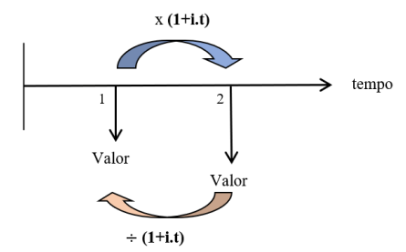
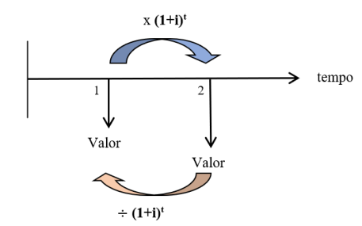

# Equivalência de Capitais

 

## DEFINIÇÃO
* A equivalência de capitais envolve operações de antecipação ou prorrogação de valores. Trata-se portanto do deslocamento dos juros de um valor futuro para um valor presente, ou de um valor presente para um valor futuro.
* Esse processo transforma o valor dos juros a pagar ou receber originalmente em diferentes períodos e valores por juros equivalentes em um novo período definido comum a todos.
* A equivalência de capitais se dá em regime simples e em regime composto.

> ### Equivalência de capitais em regime simples

#### Postergação do valor
* Para avançar um valor para o futuro, o novo valor é será o produto do valor presente pela taxa equivalente.
* Fórmula:
  - x = c.(1 + i.t)
  - x = capital equivalente
  - c = capital presente
  - i = taxa de juros
  - t = prazo

#### Antecipação do valor
* Para antecipar um valor futuro para o presente, o novo valor é a razão do valor presente pela taxa equivalente.
* Fórmula:
  - x = c/(1 + i.t)
  - x = capital equivalente
  - c = capital presente
  - i = taxa de juros
  - t = prazo

 

    

            

Ex: Um comerciante tem 3 mil a pagar daqui a 4 meses e 4.600 daqui a 9 meses, quanto ele paga se pagar o valor total daqui a 6 meses? (taxa: 5% a.m, regime simples)

DADOS:  
valor a postergar de 4 para 6 meses (2 meses) = 3.000,00   
valor a antecipar de 9 para 6 meses (3 meses) = 4.600,00  
t = 6 meses  
i = 5% a.m  

1. Montar fórmula => x = 3000 . (1 + 0,05 . 2) + 4600/(1 + 0,05 . 3)
2. Resolver parêntese => x = 3000 . (1 + 0,05 . 2) + 4600/(1 + 0,05 . 3) => x = 3000 . (1,1) + 4600/(1,15)
3. Multiplicar e dividir => x = 3000 . (1,1) + 4600/(1,15) => x = 3300 + 4000
4. Somar => x = 3300 + 4000 = 7300
5. Resposta: x = 7300

> ### Equivalência de capitais em regime composto

#### Postergação do valor
* Para avançar um valor para o futuro, o novo valor é será o produto do valor presente pela taxa equivalente.
* Fórmula:
  - x = c.(1 + i)t
  - x = capital equivalente
  - c = capital presente
  - i = taxa de juros
  - t = prazo

#### Antecipação do valor
* Para antecipar um valor futuro para o presente, o novo valor é a razão do valor presente pela taxa equivalente.
* Fórmula:
  - x = c/(1 + i)t
  - x = capital equivalente
  - c = capital presente
  - i = taxa de juros
  - t = prazo

 

    

            

Ex: Uma dívida tem 2 parcelas de 2 mil a pagar daqui a 1 mês e 4 meses, quanto ele paga se pagar o valor total daqui a 3 meses? (taxa: 2% a.m, regime composto)

DADOS:  
valor a postergar de 1 para 3 meses (2 meses) = 2.000,00   
valor a antecipar de 4 para 3 meses (1 mês) = 2.000,00  
t = 3 meses  
i = 2% a.m  

1. Montar fórmula => x = 2000 . (1 + 0,02)2 + 2000/(1 + 0,02)1
2. Resolver potência e parêntese => x = 2000 . (1 + 0,02)2 + 2000/(1 + 0,02)1 => x = 2000 . (1,02)2 + 2000/(1,02) => x = 2000 . 1,0404 + 2000/1,02
3. Multiplicar e dividir => x = 2000 . 1,0404 + 2000/1,02 => x = 2.080,8 + 1960,78
4. Somar => x = 2.080,8 + 1960,78
5. Resposta: x = 4041,58

***DICA:*** Construir o diagrama de fluxo de caixa auxilia a visualizar o novo prazo comum.