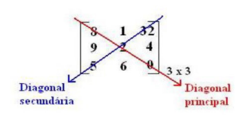
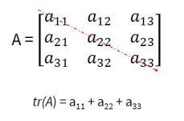

# Matrizes

## Definição
- É uma tabela de elementos dispostos, ordenadamente, em linhas e colunas. Ou, denominase matriz m X n (lê-se m por n) uma tabela retangular formada por m.n números reais, dispostos em **m** linhas e **n** colunas.
- Uma matriz é um conjunto de números organizados em forma tabela, ou seja, em linhas e colunas que se relacionam. 
- Cada número em uma matriz é chamado de elemento da matriz ou simplesmente elemento.
- Os elementos de uma matriz podem ser quaisquer números reais, incluindo números irracionais e negativos. Não há restrições quanto à natureza dos números que compõem a matriz.
- A ordem de uma matriz é indicada pelo seu numero de linhas e colunas. A primeira dimensão indica o número de linhas, e a segunda dimensão indica o número de colunas. Por exemplo, uma matriz 2x3 é formada por duas linhas e três colunas. 
- O produto do número de linhas pelo número de colunas (2×3) resulta em 6, que corresponde à quantidade de elementos presentes na matriz.
- Representação:
  - A = [1 2 3; 4 5 6]
  - ; = Cada ponto e vírgula separa as linhas 

| 1 | 2 | 3 |
|---|---|---|
| 4 | 5 | 6 |

> ### Representação Algébrica de uma Matriz ou Matriz Genérica
- Uma matriz genérica é aquela que não possui números específicos. Sendo representada por elementos de forma simbólica. Essa é a representação algébrica de uma matriz
- Sua representação é definida por uma letra maiúscula que representa a matriz e cada elemento é representado pela mesma letra em forma minúscula acompanhada da sua posição na matriz seguida de **i** e **j**. O **i** representa a linha que o elemento pertence e o **j** representa a coluna que o elemento pertence.
- Representação:
  - A = (aij)mXn = [ a11 a12 a1n; am1 am2 amn]

| a11 | a12 | a1n |
|-----|-----|-----|
| a21 | a22 | a2n |
| am1 | am2 | amn |

> ### Lei de Formação de uma Matriz
- A lei de formação define o valor de cada elemento aij em função dos seus índices **i** e **j**.
- Para calcular o elemento aij, basta substituir os valores de i e j na lei de formação.
- É uma ferramenta útil para encontrar os elementos de uma matriz, especialmente quando se trata de matrizes com grande número de elementos. 
- É importante lembrar que a lei de formação deve ser específica para a matriz em questão.

Ex: Achar os elementos da matriz A = (aij)3x2, em que aij = 3i-j.
1. A = [ a11 a12; a21 a22; a31 a32]
2. a11 = 3.1 - 1 = 3 - 1 = 2
3. a12 = 3.1 - 2 = 3 - 2 = 1
4. a21 = 3.2 - 1 = 6 - 1 = 5
5. a22 = 3.2 - 2 = 6 - 2 = 4
6. a31 = 3.3 - 1 = 9 - 1 = 8
7. a32 = 3.2 - 2 = 9 - 7 = 7
8. A = [ 2 1; 5 4; 8 7]
9. Resultado:

| 2 | 1 |
|---|---|
| 5 | 4 |
| 8 | 7 |

> ### Tipos de Matrizes

#### Matriz Quadrada
- Possui o mesmo número de linhas e colunas, formando um quadrado.
- Os elementos aij de uma matriz quadrada, em que i = j, formam uma diagonal denominada diagonal principal. A outra diagonal é chamada diagonal secundária.
- Por exemplo, uma matriz 3x3 é uma matriz quadrada de ordem 3.
 
| 2 | 1 | 3 |
|---|---|---|
| 5 | 4 | 0 |
| 8 | 7 | 9 |

    

      

#### Matriz Retangular
- O número de linhas é diferente do número de colunas. 
- Por exemplo, uma matriz 2x3 tem duas linhas e três colunas.

| 2 | 1 | 3 |
|---|---|---|
| 5 | 4 | 0 |

#### Matriz Linha
- Tem apenas uma linha e múltiplas colunas. 
- Por exemplo, uma matriz 1x3 possui uma linha e três colunas.

| 2 | 1 | 3 |
|---|---|---|

#### Matriz Coluna
- Possui apenas uma coluna e múltiplas linhas. 
- Por exemplo, uma matriz 3x1 tem três linhas e uma coluna.

| 2 |
|---|
| 5 |
| 8 |

#### Matriz Diagonal
- Todos os elementos fora da diagonal principal são iguais a zero. 
- É importante observar os elementos fora dessa diagonal para determinar se uma matriz é diagonal.

| 2 | 0 | 0 |
|---|---|---|
| 0 | 4 | 0 |
| 0 | 0 | 9 |

#### Matriz Transposta
- É a matriz, obtida de **A** transformando suas **m** linhas em colunas ou de modo equivalente, suas **n** colunas em linhas.
- Representação:
- At

| 1 | 3 | 4 |   
|---|---|---| 
| 7 | 8 | 9 |

| 1 | 7 |
|---|---|
| 3 | 8 |
| 4 | 9 |

#### Matriz Ortogonal
- Uma matriz quadrada é ortogonal quando a sua transposta coincide com a sua inversa.
- Representação:
- A = A-1

| 1 | 0 |
|---|---|
| 0 | -1|

#### Matriz Simétrica
- Uma matriz é simétrica se coincidir com a sua transposta.
- Representação:
- A = At

| 2 | 7 |
|---|---|
| 7 | 4 |

#### Matriz Unidade ou Identidade
- É uma matriz diagonal, com os elementos da diagonal principal iguais a 1.

| 1 | 0 | 0 |
|---|---|---|
| 0 | 1 | 0 |
| 0 | 0 | 1 |

#### Matriz Triangular Superior
- Possui todos os elementos acima da diagonal principal iguais a zero.

| 4 | 0 | 0 |
|---|---|---|
| 5 | 7 | 0 |
| 3 | 1 | 2 |

#### Matriz Triangular Inferior
- Tem todos os elementos abaixo da diagonal principal iguais a zero.

| 3 | 9 | 1 |
|---|---|---|
| 0 | 6 | 2 |
| 0 | 0 | 5 |

#### Matriz Nula
- Possui todos os elementos iguais a zero.

| 0 | 0 |
|---|---|
| 0 | 0 |

#### Matriz Oposta
- A matriz oposta a matriz **A** é aquela que possui elementos correspondentes opostos aos da matriz **A**. 

| 6 | 5 |
|---|---|
| 2 | 9 |

|-6 | -5|
|---|---|
|-2 | -9|

> ### Igualdade de Matrizes
- Para que duas ou mais matrizes sejam consideradas iguais elas devem obedecer a
algumas regras:
  - 1ª)Devem ter a mesma ordem, ou seja, o mesmo número de linhas e o mesmo número de colunas.
  - 2ª) Os elementos devem ser iguais aos seus correspondentes.

Exemplo: A matriz A2x2 é igual a matriz B se, somente se, a matriz B tiver também a ordem 2x2 e os elementos a11 = b11, a21 = b21, a12 = b12 e a22 = b22.    

A:

| 2 | -1|
|---|---|
| 8 | 4 |

B:

| 2 | -1|
|---|---|
| 8 | 4 |

> ### Traço de uma Matriz
- O traço de uma matriz é a soma dos elementos de sua diagonal principal. 
- Esse conceito é relevante em questões que envolvem matrizes. O traço só pode ser calculado em matrizes quadradas, pois apenas elas possuem diagonal principal. 
- Para calcular o traço, basta somar os elementos dessa diagonal. 
- O traço é representado com a notação tr(A), onde **A** é a matriz em questão.
- Propriedades:
  - tr(A) = tr(At): O traço de uma matriz quadrada é igual ao da sua transposta.                 
  - tr(AB) = tr(BA): O traço de um produto de matrizes quadradas não depende da ordem do produto.

    

       

Ex:

|-1 | 4 |
|---|---|
| 3 | -5|

1. tr(A) = -1 + (-5)
2. tr(A) = -6
