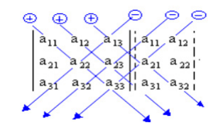

# Determinantes

## 1. Definição
- Determinante é um número real que se associa a uma matriz quadrada. Calculamos determinantes somente de matrizes quadradas, ou seja, matrizes em que a quantidade de colunas e a quantidade de linhas são iguais. 
- Para calcular o determinante de uma matriz, precisamos analisar a ordem dela, ou seja, se ela é 1x1, 2x2, 3x3 e assim sucessivamente.

## 2. Determinante de uma Matriz Quadrada de 1ª Ordem
- Uma matriz é conhecida como de ordem 1 (ou 1ª ordem) quando possui exatamente uma linha e uma coluna. Quando isso ocorre, a matriz possui um único elemento, o a11.
- Nesse caso o determinante da matriz coincide com esse seu único termo. 
- Exemplo:
  - A = 2
  - det(A) = 2

## 3. Determinante de uma Matriz Quadrada de 2ª Ordem
- Dada a matriz quadrada de 2ª ordem A = a11 a12 a21 a22, chama-se determinante associado à matriz A (ou determinante de 2ª ordem) o número real obtido pela diferença
entre o produto dos elementos da diagonal principal e o produto dos elementos da diagonal secundária.
- Conforme a ordem vai aumentando o grau para encontrar a determinante também aumenta.
- Representação:
  - det(A) = a11. a22 – a12. a21

Exemplo: A = [4 -3; 6 -1] det(A)?

1. det(A) = 4 * (-1) = -4
2. det(A) = 6 * (-3) = -18
3. det(A) = -4 - (-18) = 14
4. det(A) = 14

## 4. Determinante de uma Matriz Quadrada de 3ª Ordem
- Podemos obter o determinante de uma matriz de 3ª ordem utilizando uma regra prática muito simples denominada regra de Sarrus.

#### Regra de Sarrus
- A regra de Sarrus consiste em repetir sempre a primeira e segunda coluna, posteriormente é feito o produto das diagonais e vão ser encontrados seis valores. Três valores da
diagonal principal e três valores da diagonal secundária.

Exemplo: Seja a matriz A = [ a11 a12 a13; a21 a22 a23; a31 a32 a33]  

1. Vamos repetir a 1ª e a 2ª coluna à direita da matriz, conforme o esquema abaixo:

    

      

2. Multiplicando os termos entre si, seguindo os traços em diagonal e associando aos produtos o sinal indicado, temos: det A = a11.a22.a33 + a12.a23.a31 + a13.a21.a32 – a13.a22.a31 – a11.a23.a32 – a12.a21.a33

Exemplo 2: Calcular o determinante da matriz A, sendo A = [ -1 2 3; 0 1 4; -2 -3 -5]  

1. Reprete as 2 primeiras colunas: [ -1 2 3 -1 2; 0 1 4 0 1; -2 -3 -5 -2 -3] 
2. det (A) = -1 * 1 * 5 = -5
3. det (A) = 2 * 4 * -2 = -16
4. det (A) = 3 * 0 * -3 = 0
5. det (A) = -5 -16
6. det (a) = -2 * 1 * 3 = -6 transformando o sinal = 6
7. det (a) = -3 * 4 * -1 = 12 transformando o sinal = -12
8. det(a) = 5 * 0 * 2 = 0
9. det (A) = -5 -16 + 6 - 12
10. det(A) = -27 

## 5. Cofator
- Chamamos de cofator ou complemento algébrico relativo a um elemento aij da matriz A, ao produto do número (-1)i+j pelo determinante da matriz que se obtém eliminando a linha i e a coluna j da matriz A.

Exemplo: Dado A = [ 3 2 1; 2 1 4; 1 1 3], obter o cofator de a32   

1. O cofator vai sempre falar em relação ao elemento, no caso quer saber o cofator a32.
2. O primeiro algarismo vai representar a posição da linha e o segundo a posição da coluna. A32 = 1
3. Depois de localizar o elemento, a linha será eliminada e a coluna.
4. A = [ 3 1; 2 4]
5. A32 = (-1)^3+2 
6. A32 = (-1)^5 = 3 * 4 = 12 | 2 * 1 = 2
7. A32 = (-1) * (12 - 2)
8. A32 = (-1) * 10
9. A32 = -10 

## 6. Teorema de Laplace
- O valor de um determinante é a soma dos produtos dos elementos de uma fila pelos respectivos cofatores.
- O teorema de Laplace também pode ser utilizado para encontrar o determinante de matriz de ordem três, inclusive superior a três.
- Fila é uma linha ou coluna.

Exemplo: Calcule o determinante da matriz A = [ 2 0 1; 3 1 1; 4 3 1]  

1. Vamos calculá-lo pelo Teorema de Laplace, desenvolvendo pela primeira linha: det (a) = 2 * A11 + 0 * A12 + 1* A13
2. [1 1; 3 1]
3. A11 = (-1)i+j * ⟶ A11 = (-1)1+1 * (1-3) ⟶ A11 = -2
4. [3 1; 4 1]
5. A12 =(-1)i+j * ⟶ A12 = (-1)^3 * (-1) ⟶ A12 = 1
6. [3 1; 4 3]
7. A13 = (-1)i+j * ⟶ A13 = (-1)^4 * 5 ⟶ A13 = 5
8. det(A) = 2 * -2 + 0 * 1 + 1 * 5
9. det(A) = 1 