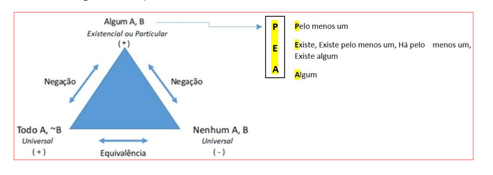

# Proposições Categóricas

## 1. Definição
- Proposição Categórica é uma proposição que afirma ou nega que todos ou alguns dos membros de uma categoria (o termo sujeito) estão incluídos em outra (o termo predicado). 
- Podem ser Universais (TODO, NENHUM) ou Particulares (ALGUM, EXISTE, PELO MENOS UM); Afirmativas ou Negativas (NÃO, NADA, NENHUM).
- Estrutura:
  - Todo A é B.
  - Nenhum A é B.
  - Algum A é B.
  - Algum A não é B.
- Exemplos:
  - Todo cão é bravo.
  - Nenhum homem é imortal.
  - Algum pássaro é azul.
  - Alguns gatos não são pretos.

#### Quantidade e Qualidade
- Quantidade refere-se ao número de membros da classe de sujeito que são usados na proposição. 
- Se a proposição se refere a todos os membros da classe de sujeito, ela é universal. 
- Se a proposição não emprega todos os membros da classe de sujeito, é particular. Por exemplo, uma proposição ("Alguns A são B") é particular, pois se refere apenas a alguns dos
membros da classe de sujeito.
- Qualidade é descrita como se a proposição afirma ou nega a inclusão de um sujeito dentro da classe do predicado. As duas qualidades possíveis são chamadas afirmativas e negativas. 
- Por exemplo, uma proposição A ("Todos os A são B") é afirmativa, pois afirma que o assunto está contido no predicado. Por outro lado, uma proposição O ("Alguns A não são B") é negativa, pois exclui o sujeito do predicado.

| DECLARAÇÃO          | QUANTIDADE  | QUALIDADE  |
|---------------------|-------------|------------|
| Todo A é B.         | Universal   | Afirmativa |
| Nenhum A é B.       | Universal   | Negativa   |
| Algum A é B.        | Particular  | Afirmativa |
| Alguns A não são B. | Particular  | Negativa   |

## 2. Equivalência e Negação de uma proposição categórica
- Para equivalência ou negação de uma proposição categórica, basta utilizar o seguinte esquema do triangulo TAM.

    

        

#### Regras do triângulo
1. **Negação**: sobe do vértice para a base.
   - Negação de **Todo** = **Algum ... não é**
   - Negação de **Nenhum** = **Algum é**
   - Negação de **Algum** = **Todo ... não é** **ou** **Nenhum é**
2. **Equivalência**: ocorre entre **Todo** e **Nenhum** (laterais do triângulo).
   - Exemplo: "Todo A é não‑B" ⇔ "Nenhum A é B"

#### Sinônimos de "Algum"
- Pelo menos um
- Existe
- Há pelo menos um

## 3. Negação de Proposições Categóricas
- Regra geral: A negação de uma proposição universal é uma proposição particular, e a negação de uma afirmativa é uma negativa (ou vice-versa).

#### Exemplos de negação
1. **Todo A é B**  
   Negação: **Algum A não é B**  
   Ex.: "Todo cão é bravo" → Negação: "Algum cão não é bravo"
2. **Nenhum A é B**  
   Negação: **Algum A é B**  
   Ex.: "Nenhum homem é imortal" → Negação: "Algum homem é imortal"
3. **Algum A é B**  
   Negação: **Nenhum A é B**  **ou**  **Todo A não é B**  
   Ex.: "Algum pássaro é azul" → Negação: "Nenhum pássaro é azul" ou "Todo pássaro não é azul"

#### Equivalências Notáveis
1. **Todo A é não‑B** ⇔ **Nenhum A é B**  
   Ex.: "Todo cientista não é estudioso" ⇔ "Nenhum cientista é estudioso"
2. **Nenhum A é não‑B** ⇔ **Todo A é B**  
   Ex.: "Nenhum pedreiro não é operário" ⇔ "Todo pedreiro é operário"

#### Macete para Encontrar Negação
- Deve-se pegar o quantificador e encontrar o seu equivalente que realiza a negação a partir da tabela a seguir.

| PREPOSIÇÃO | NEGAÇÃO | EXPLICAÇÃO      |
|------------|---------|-----------------|
| E          | T       | Existe → Todo   |
| N          | E       | Nenhum → Existe |
| E          | N       | Existe → Nenhum |
| T          | E       | Todo → Existe   |

- Exemplos:
  - "Todo concurseiro adora lógica." (T → E) = "Algum concurseiro não adora lógica."
  - "Nenhuma laranja está madura." (N → E) = "Alguma laranja está madura."
  - "Existe caneta preta." (E → T) ou (E → N) = "Toda caneta não é preta." ou "Nenhuma caneta é preta".