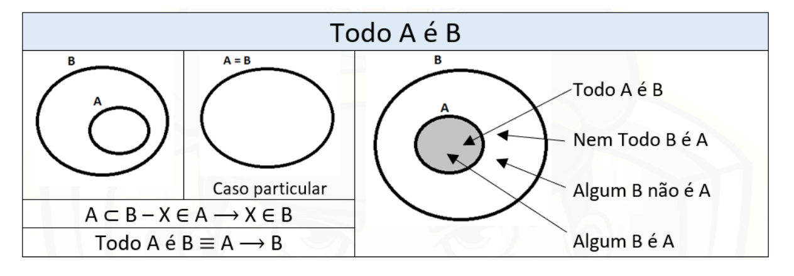
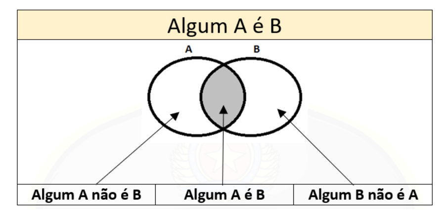
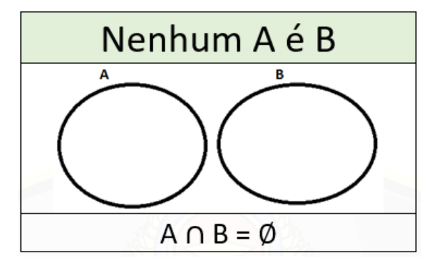

# Diagramas Lógicos

## 1. Definição
- As questões de Diagramas lógicos envolvem as proposições categóricas (todo, algum, nenhum), cuja solução requer que desenhemos figuras, os chamados diagramas lógicos.

## 2. Todo A é B
- O conjunto **A** está contido no conjunto **B**.
- Todo elemento de **A** também é elemento de **B**.
- Não se pode afirmar que todo **B** é **A**.

#### Representação

    

        

#### Exemplos
1. "Todos os advogados são honestos".  
    - Conjunto dos advogados ⊂ Conjunto dos honestos.
2. "Todo trabalhador é responsável".  
    - Conjunto dos trabalhadores ⊂ Conjunto dos responsáveis.

## 3. Algum A é B
- Existe pelo menos um elemento que pertence a **A** e a **B** simultaneamente.
- Os conjuntos A e B têm interseção não vazia.

#### Representação

    

       

#### Exemplos
1. "Alguns escritores são poetas".  
    - Há pessoas que são escritores e poetas.
2. "Algum advogado é honesto".  
    - Existe pelo menos um advogado honesto.

## 4. Nenhum A é B
- Os conjuntos **A** e **B** são disjuntos.
- Não há elemento comum entre **A** e **B**.
- **A** e **B** são mutuamente exclusivos.

#### Representação

    

       

#### Exemplos
1. "Nenhum pássaro é animal".  
    - Todos os animais não são pássaros.
2. "Nenhum advogado é honesto".  
    - Todo advogado é desonesto.

## 5. Dicas para Resolução
1. Desenhe os diagramas sempre que possível.
2. Para "Todo A é B", lembre-se de que **A ⊂ B**.
3. Para "Algum A é B", garanta que **há interseção**.
4. Para "Nenhum A é B", os conjuntos **não se tocam**.
5. Use as informações dadas para preencher o diagrama passo a passo.
