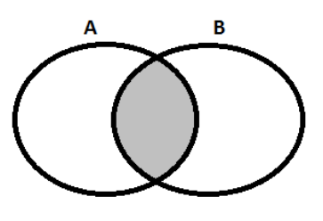
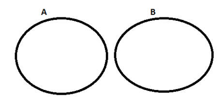

# Lógica de 1ª Ordem (Lógica de Predicados)

## 1. Definição
- A lógica de primeira ordem, conhecida também como lógica dos predicados, é um sistema lógico que estende a lógica proposicional (lógica sentencial) e que é estendida pela lógica de segunda ordem. 
- O ingrediente novo da lógica de primeira ordem não encontrado na lógica proposicional é a quantificação.
- Os quantificadores são utilizados para transformar uma sentença aberta (ou proposição aberta) em uma proposição lógica. 
- Essa relação, em regra, é feita através de um quantificador formando assim, as chamadas proposições categóricas.

#### Sentenças Abertas (ou Funções Proposicionais)
- São expressões que contêm variáveis.
- Não são proposições, pois seu valor lógico (V/F) depende do valor atribuído à variável.
- Exemplo: "2x - 8 = 0" só é verdadeira se x = 4.
- Há duas maneiras de transformar sentenças abertas em proposição:
  - Atribuir valor à variável.
  - Utilizar quantificadores.

## 2. Quantificadores
- Palavras ou símbolos que indicam quantidade, transformando sentenças abertas em proposições.
- Eles são utilizados para indicar a quantidade de valores que a variável de uma sentença precisa assumir para que esta sentença se torne verdadeira ou falsa e assim gere uma proposição.
- Representação:
  - Quantificador + sentença aberta = Proposição
- São exemplos de quantificadores as expressões: existe, algum, todo, cada, pelo menos um, nenhum.

#### 2.1 Quantificador Universal (∀)
- É indicado pelo símbolo ∀ e representa a totalidade de elementos. Significa que todos os elementos estão contemplados dentro de uma mesma característica.
- Significado: Todo, Qualquer, Para todo, Qualquer que seja.
- Proposição categórica: "Todo **A** é **B**" (Frase universal afirmativa)
- As proposições envolvendo o quantificador **TODO** podem ser transformadas em condicionais, na forma "Se for **A**, então é **B**".
- Representação:
  - ∀x (A(x) → B(x))
  - Leitura: "Para todo x, se x é A, então x é B".
- Exemplo: 
  - "Todo mineiro é brasileiro".
- Representação utilizando os diagramas de Euler/Venn:

    

       

### 2.2 Quantificador Existencial ou Particular(∃)
- É indicado pelo símbolo ∃ e representa a existência de no mínimo um elemento dentro de uma determinada característica.
- Significado: Existe, Algum, Pelo menos um.
- Proposição categórica: "Algum **A** é **B**" (Frase particular afirmativa)
- Representação:
  - ∃x (A(x) ∧ B(x))
  - Leitura: "Existe um x tal que x é **A** e x é **B**".
- Exemplo: 
  - "Algum aluno é cantor".
- Representação utilizando os diagramas de Euler/Venn:

    

       

#### 2.3 Quantificador de Unicidade (∃!)
- Deriva do quantificador existencial, ele é chamado de quantificador existencial de unicidade.
- Símbolo: ∃!
- Significado: "Existe um único".
- Exemplo: 
  - ∃!x ∈ ℕ (x + 5 = 7) → apenas x = 2 satisfaz.
  - Leitura: "Existe um único número x pertencente ao conjunto dos números naturais tal que x + 5 = 7".

### 2.3 Quantificador Universal Negativo (¬∃)
- Representa a ausência de elementos com uma determinada característica.
- Significado: "Nenhum", "Não existe", "Nada", "Ninguém".
- Proposição categórica: "Nenhum **A** é **B**" (Frase universal negativa)
- Representação:
  - ¬∃x (A(x) ∧ B(x))
  - Leitura: "Não existe x tal que x é **A** e x é **B**".
- Diagrama: Conjuntos A e B são disjuntos (sem interseção).
- Exemplo: 
  - "Nenhum aluno foi reprovado".
- Representação utilizando os diagramas de Euler/Venn:

    

       

## 3. Proposições Categóricas

| PROPOSIÇÃO      | QUANTIDADE | QUALIDADE  | SÍMBOLO LÓGICO    |
|-----------------|------------|------------|-------------------|
| Todo A é B      | Universal  | Afirmativa | ∀x (A(x) → B(x))  |
| Nenhum A é B    | Universal  | Negativa   | ¬∃x (A(x) ∧ B(x)) |
| Algum A é B     | Particular | Afirmativa | ∃x (A(x) ∧ B(x))  |
| Algum A não é B | Particular | Negativa   | ∃x (A(x) ∧ ¬B(x)) |

## 4. Dicas para Resolução
1. Identifique o quantificador na frase.
2. Traduza para a forma simbólica conforme a tabela.
3. Use diagramas de Venn para visualizar relações entre conjuntos.
4. Lembre-se: "Todo A é B" = A → B (condicional).
5. "Algum A é B" = ∃x (A(x) ∧ B(x)) (conjunção).