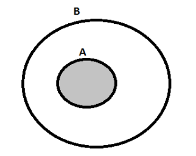
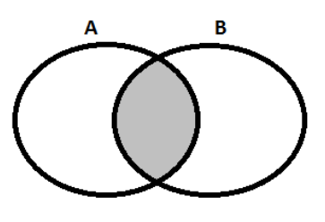
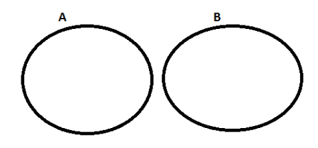

# Lógica de 1ª Ordem (Lógica de Predicados)

> ## 1. Definição
- A lógica de primeira ordem, conhecida também como lógica dos predicados, é um sistema lógico que estende a lógica proposicional (lógica sentencial). Ela permite analisar a estrutura interna das sentenças, indo além das conexões entre proposições inteiras.
- Diferença crucial:
  - Lógica Proposicional: Trabalha com proposições inteiras (P, Q, R) e conectivos. Não analisa o sujeito e o predicado. Ex: P = "João é alto". A estrutura interna de "João" e "alto" é ignorada.
  - Lógica de Primeira Ordem: Decompõe a frase em termos (objetos) e predicados (propriedades ou relações). Ex: Alto(João). Permite quantificar sobre os objetos.
- É chamada de "primeira ordem" porque os quantificadores (∀, ∃) só podem variar sobre objetos (indivíduos), e não sobre propriedades ou funções.

> #### Sentenças Abertas (ou Funções Proposicionais)
- São expressões que contêm variáveis.
- Não são proposições, pois seu valor lógico (V/F) depende do valor atribuído à variável.
- Exemplo: "2x - 8 = 0" só é verdadeira se x = 4.
- Há duas maneiras de transformar sentenças abertas em proposição:
  - Atribuir valor à variável.
  - Utilizar quantificadores.

> ## 2. Quantificadores
- Palavras ou símbolos que indicam quantidade, transformando sentenças abertas em proposições.
- Eles são utilizados para indicar a quantidade de valores que a variável de uma sentença precisa assumir para que esta sentença se torne verdadeira ou falsa e assim gere uma proposição.
- Representação:
  - Quantificador + sentença aberta = Proposição
- São exemplos de quantificadores as expressões: existe, algum, todo, cada, pelo menos um, nenhum.

> ### 2.1 Quantificador Universal (∀)
- É indicado pelo símbolo ∀ e representa a totalidade de elementos. Significa que todos os elementos estão contemplados dentro de uma mesma característica.
- Significado: Todo, Qualquer, Para todo, Qualquer que seja.
- Proposição categórica: "Todo **A** é **B**" (Frase universal afirmativa)
- As proposições envolvendo o quantificador **TODO** podem ser transformadas em condicionais, na forma "Se for **A**, então é **B**".
- Representação:
  - ∀x (A(x) ⟶ B(x))
  - Leitura: "Para todo x, se x é A, então x é B".
- Exemplo: 
  - "Todo mineiro é brasileiro".
- Representação utilizando os diagramas de Euler/Venn:

    

       

> ### 2.2 Quantificador Existencial ou Particular(∃)
- É indicado pelo símbolo ∃ e representa a existência de no mínimo um elemento dentro de uma determinada característica.
- Significado: Existe, Algum, Pelo menos um.
- Proposição categórica: "Algum **A** é **B**" (Frase particular afirmativa)
- Representação:
  - ∃x (A(x) ∧ B(x))
  - Leitura: "Existe um x tal que x é **A** e x é **B**".
- Exemplo: 
  - "Algum aluno é cantor".
- Representação utilizando os diagramas de Euler/Venn:

    

       

> ### 2.3 Quantificador de Unicidade (∃!)
- Deriva do quantificador existencial, ele é chamado de quantificador existencial de unicidade.
- Símbolo: ∃!
- Significado: "Existe um único".
- Exemplo: 
  - ∃!x ∈ ℕ (x + 5 = 7) ⟶ apenas x = 2 satisfaz.
  - Leitura: "Existe um único número x pertencente ao conjunto dos números naturais tal que x + 5 = 7".

> ### 2.3 Quantificador Universal Negativo (¬∃)
- Representa a ausência de elementos com uma determinada característica.
- Significado: "Nenhum", "Não existe", "Nada", "Ninguém".
- Proposição categórica: "Nenhum **A** é **B**" (Frase universal negativa)
- Representação:
  - ¬∃x (A(x) ∧ B(x))
  - Leitura: "Não existe x tal que x é **A** e x é **B**".
- Diagrama: Conjuntos A e B são disjuntos (sem interseção).
- Exemplo: 
  - "Nenhum aluno foi reprovado".
- Representação utilizando os diagramas de Euler/Venn:

    

       

> ## 3. Representação Simbolica das Proposições Categóricas

| PROPOSIÇÃO      | QUANTIDADE | QUALIDADE  | SÍMBOLO LÓGICO    |
|-----------------|------------|------------|-------------------|
| Todo A é B      | Universal  | Afirmativa | ∀x (A(x) → B(x))  |
| Nenhum A é B    | Universal  | Negativa   | ¬∃x (A(x) ∧ B(x)) |
| Algum A é B     | Particular | Afirmativa | ∃x (A(x) ∧ B(x))  |
| Algum A não é B | Particular | Negativa   | ∃x (A(x) ∧ ¬B(x)) |

> ## 4. Elementos da Linguagem
- A LPO é composta por símbolos lógicos e símbolos não lógicos.

> #### Símbolos Lógicos (comuns a qualquer teoria)
- Conectivos Proposicionais: ¬ (não), ∧ (e), ∨ (ou), → (se... então), ↔ (se e somente se).
- Quantificadores:
  - ∀ (Para Todo / Universal): "Para todo x", "Qualquer que seja x".
  - ∃ (Existe / Existencial): "Existe pelo menos um x", "Para algum x".
- Variáveis: Símbolos que representam objetos indeterminados (x, y, z, ...).
- Igualdade (opcional): O símbolo = para indicar que dois termos denotam o mesmo objeto.

> #### Símbolos Não Lógicos (específicos de cada domínio):
- Constantes: Nomes próprios de objetos específicos no domínio (a, b, c, João, 0, 1, ...).
- Predicados (ou Relações): Representam propriedades de objetos ou relações entre eles. Ex: P(x) ("x é par"), Amigo(x, y) ("x é amigo de y").
- Funções: Mapeiam objetos para objetos. Ex: pai(x) ("o pai de x"), soma(x, y) ("x + y").

> ## 5. Sintaxe, Termos e Fórmulas

> #### Termo
- É uma expressão que representa um objeto.
- Toda constante é um termo (ex: João).
- Toda variável é um termo (ex: x).
- Se f é um símbolo de função e t é um termo, f(t) é um termo (ex: pai(João)).

> #### Fórmula Atômica
- É a unidade básica que pode ser verdadeira ou falsa.
- Se P é um predicado de aridade n (que recebe n argumentos) e t1, t2, ..., tn são termos, então P(t1, t2, ..., tn) é uma fórmula atômica.
- Ex: MaiorQue(3, 2) ou Gosta(Maria, chocolate).

> #### Fórmula Bem-Formada (FBF)
- É construída a partir das fórmulas atômicas usando os conectivos proposicionais e os quantificadores.
- Ex: ∀x (Humano(x) ⟶ Mortal(x))
- Ex: ∃x (Cachorro(x) ∧ Late(x))

> #### Exemplos de Tradução da Linguagem Natural para a LPO

| FRASE EM PORTUGUÊS            | REPRESENTAÇÃO EM LPO                                        |
|-------------------------------|-------------------------------------------------------------|
| Todos os gatos são mamíferos. | ∀x (Gato(x) ⟶ Mamifero(x))                                 |
| Algum pássaro não voa.        | ∃x (Passaro(x) ∧ ¬Voa(x))                                   |
| Nenhum metal é líquido.       | ∀x (Metal(x) ⟶ ¬Liquido(x)) ou ¬∃x (Metal(x) ∧ Liquido(x)) |
| João ama Maria.               | Ama(João, Maria)                                            |
| Existe um número primo e par. | ∃x (Primo(x) ∧ Par(x))                                      |

> ## 6. Interpretação e Valor Verdade
- Interpretação: Para atribuir valor verdade a uma fórmula, é necessário definir um domínio (conjunto de objetos sobre os quais as variáveis podem variar) e atribuir significados aos símbolos não lógicos (constantes, predicados, funções).
- Valor Verdade: Uma fórmula é verdadeira em uma interpretação se, ao percorrer todo o domínio, a condição imposta pelos quantificadores for satisfeita.
- Regras para os Quantificadores:
  - ∀x P(x) é verdadeiro se P(x) for verdadeiro para todos os objetos x do domínio.
  - ∃x P(x) é verdadeiro se P(x) for verdadeiro para pelo menos um objeto x do domínio.

## 7. Escopo e Variáveis Livres/Amarradas
- Escopo de um Quantificador: É a parte da fórmula onde o quantificador atua. É a subfórmula imediatamente à sua direita (geralmente entre parênteses).
- Variável Amarrada (ou Ligada): Uma variável que está dentro do escopo de um quantificador que a menciona.
- Variável Livre: Uma variável que não está no escopo de nenhum quantificador.
- Sentença: É uma fórmula que não possui variáveis livres. Todas as variáveis estão amarradas por um quantificador.
- Exemplo: Na fórmula ∃x (P(x) ∧ Q(y)):
  - x é uma variável amarrada (dentro do escopo do ∃).
  - y é uma variável livre.

## 8. Propriedades Importantes

> #### Equivalências com Quantificadores                                        
- ¬∀x P(x) ≡ ∃x ¬P(x) (A negação de "todo" é "existe algum que não").      
- ¬∃x P(x) ≡ ∀x ¬P(x) (A negação de "existe" é "nenhum" ou "todo... não"). 

> #### Escopo e Parênteses                                            
- ∀x (P(x) ∧ Q(x)) é diferente de (∀x P(x)) ∧ Q(x)               
- No primeiro, Q(x) depende de x. No segundo, Q(x) tem x livre.