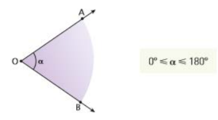
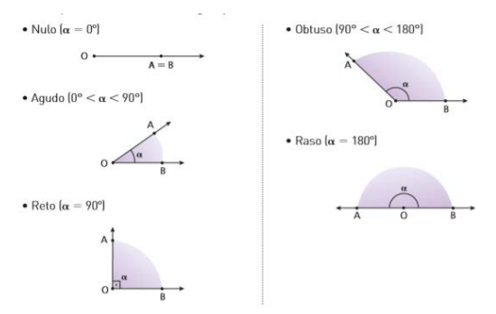
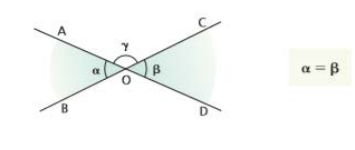
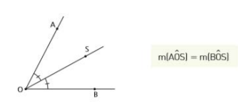
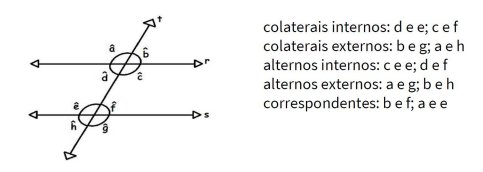

# Ângulos

## 1. Definição e Elementos
- Ângulo é a região convexa determinada por duas semirretas de mesma origem.
- Vértice (O): ponto de origem comum.
- Lados: as duas semirretas (OA e OB).
- Medida (α): dada em graus (°), com 0° ≤ α ≤ 180°.

    

       

## 2. Classificação dos Ângulos
1. Nulo: 0°
2. Agudo: 0° < α < 90°
3. Reto: α = 90°
4. Obtuso: 90° < α < 180°
5. Raso: α = 180°

    

               

## 3. Ângulos Complementares e Suplementares

#### Ângulos Complementares
- α + β = 90°

#### Ângulos Suplementares
- α + β = 180°

#### Exemplo de questão
Determinar o ângulo cuja medida é o quádruplo do seu complemento.
- Seja x o ângulo.
- Complemento: 90° − x
- Equação: x = 4(90° − x) → x = 360° − 4x → 5x = 360° → x = 72°
- Complemento: 90° − 72° = 18°

## 4. Ângulos Opostos pelo Vértice (OPV)
- Dois ângulos são OPV quando os lados de um são semirretas opostas aos lados do outro.
- Propriedade: têm a mesma medida.
- Exemplo: α = β

    

       

## 5. Bissetriz de um Ângulo
- Semirreta com origem no vértice que divide o ângulo em dois ângulos de mesma medida.

    

       

## 6. Retas Paralelas Cortadas por uma Transversal
- Duas retas paralelas (r e s) cortadas por uma transversal (t) formam 8 ângulos.

#### Relações entre ângulos formados:
1. Ângulos correspondentes: são iguais.
2. Ângulos alternos internos: são iguais.
3. Ângulos alternos externos: são iguais.
4. Ângulos colaterais internos: são suplementares (soma = 180°).
5. Ângulos colaterais externos: são suplementares (soma = 180°).

    

       

#### Macete
- Todos os ângulos agudos são iguais.
- Todos os ângulos obtusos são iguais.
- Um ângulo agudo e um obtuso são suplementares.

## 7. Dicas para Resolução
1. Identifique o tipo de ângulo (agudo, obtuso, reto, raso).
2. Use relações de complemento e suplemento para montar equações.
3. Em paralelas cortadas por transversal, marque todos os ângulos correspondentes e alternos.
4. Bissetriz divide o ângulo ao meio.
5. Ângulos OPV são iguais.
6. Em problemas de relógio: 60 min = 360°.