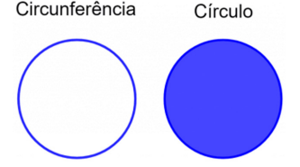
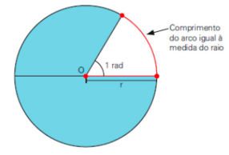
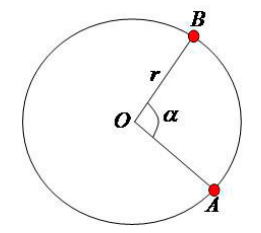
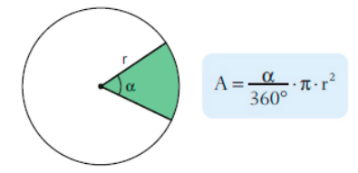
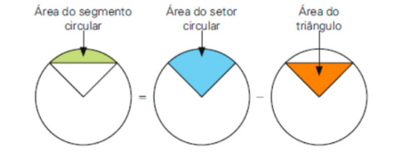
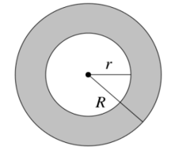

# Circunferência e Círculo

## 1. Definições Básicas
- Circunferência: conjunto de pontos equidistantes de um ponto central (a “borda”).
- Círculo: circunferência mais sua região interna (“a moeda”).
- Centro: ponto central.
- Raio (r): distância do centro a qualquer ponto da circunferência.
- Diâmetro (d): segmento que passa pelo centro, ligando dois pontos da circunferência.  
- Fórmula: d = 2r
- Corda: segmento que liga dois pontos quaisquer da circunferência.
- Arco: porção da circunferência entre dois pontos.

    

       

## 2. Área e Comprimento do Círculo

#### Comprimento (perímetro)
C = 2πr  
(π ≈ 3,14 se não for dado)

#### Área do círculo
A = πr²

    

            

## 4. Arcos e Ângulos

#### Medidas
- Grau (°): circunferência dividida em 360 partes.
- Radiano (rad): arco cujo comprimento é igual ao raio.

    

            

#### Relação fundamental
- 360° = 2π rad

#### Conversões comuns
- 30° = π/6 rad
- 45° = π/4 rad
- 60° = π/3 rad
- 90° = π/2 rad

#### Comprimento de um arco (l)
- l = α · r (α em radianos)

    

          

#### Exemplo (pêndulo)
1. r = 15 cm, α = 15°  
2. Convertendo: 15° = π/12 rad  
3. l = (π/12) · 15 = (5π/4) cm ≈ 3,9 cm

## 5. Setor Circular
- Região entre dois raios (fatia de pizza).

#### Área do setor
- Proporcional ao ângulo central α.  
- Usar regra de três:
  - Área total do círculo: πr² corresponde a 360° (ou 2π rad)
  - Área do setor (As) corresponde a α
- Fórmula direta (α em radianos):  
  - As = (α/2) · r²

#### Exemplo (gráfico de setores)
d = 12 cm → r = 6 cm  
Sem opinião: 12% do total  
Área total = π·6² = 36π ≈ 113,04 cm²  
Área do setor = 12% de 113,04 ≈ 13,56 cm²

    

         

## 6. Segmento Circular
- Região entre um arco e uma corda.

#### Área do segmento
- Aseg = Asetor − Atriângulo

#### Exemplo
r = 4 cm, α = 135°
1. Área do setor: regra de três → As = 6π cm²
2. Área do triângulo (com trigonometria): At = ½·4·4·sen(135°) = 4√2 cm²
3. Aseg = 6π − 4√2 = 2(3π − 2√2) cm²

    

         

## 7. Coroa Circular
- Região entre dois círculos concêntricos.

#### Área
- Ac = πR² − πr² = π(R² − r²)

#### Exemplo (praça com chafariz)
1. Tangente AB = 16 m → metade = 8 m  
2. Triângulo retângulo: R² = r² + 8² → R² − r² = 64  
3. Ac = π·64 = 64π m²

    

            

## 8. Dicas para Resolução
1. Identifique se o problema envolve comprimento (C = 2πr) ou área (A = πr²).
2. Para arcos: use l = α·r (α em radianos) ou regra de três.
3. Setor circular: área proporcional ao ângulo.
4. Segmento circular: subtraia área do triângulo da área do setor.
5. Coroa circular: subtraia área do círculo menor da área do maior.
6. Em questões de relógio: cada hora = 30°, cada minuto = 0,5° para o ponteiro das horas.