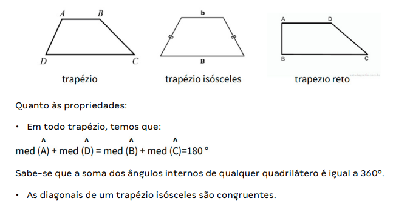
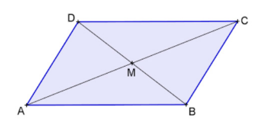
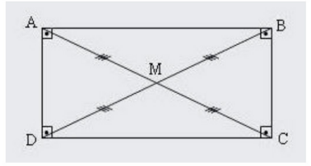
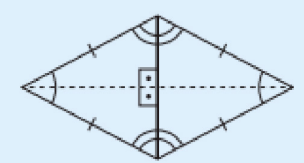
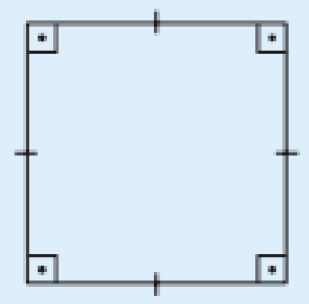

# Quadriláteros

## 1. Definição e Classificação
- Quadrilátero: polígono de quatro lados.
- Soma dos ângulos internos: 360°.
- Quadrilátero notável: possui pelo menos dois lados paralelos.

## 2. Tipos de Quadriláteros Notáveis

#### 2.1 Trapézio
- É um quadrilátero que possui dois lados paralelos (AB//CD). Os lados paralelos são chamados de bases, e os outros dois, de lados transversais.
- O trapézio é chamado de isósceles se possuir os lados não paralelos com medidas iguais, e é um trapézio retângulo se possuir um ângulo reto.

#### Classificação
1. Trapézio isósceles: lados transversais iguais.
2. Trapézio retângulo: possui um ângulo reto.

#### Propriedades
- Ângulos adjacentes a cada transversal são suplementares: A + D = B + C = 180°
- Trapézio isósceles: diagonais congruentes.

    

               

### 2.2 Paralelogramo
- É um quadrilátero que tem os lados opostos paralelos dois a dois (AD//BC e AB//CD). Consequentemente, os lados e ângulos opostos terão a mesma medida.
- Todas as propriedades existentes nos trapézios continuam sendo válidas nos paralelogramos.

#### Propriedades
- Lados opostos congruentes.
- Ângulos opostos congruentes.
- Diagonais cruzam-se no ponto médio.

    

       

### 2.3 Retângulo
- Paralelogramo com quatro ângulos retos.
- Todas as propriedades dos paralelogramos são válidas também nos retângulos. Além disso, as diagonais passam a ter a mesma medida.

#### Propriedade adicional
- Diagonais congruentes.

    

       

### 2.4 Losango
- Paralelogramo com quatro lados congruentes.

#### Propriedades adicionais
- Diagonais são perpendiculares.
- Diagonais são bissetrizes dos ângulos internos.

    

       

### 2.5 Quadrado
- Quadrilátero regular.
- Reúne todas as propriedades do retângulo e do losango.

    

       

## 3. Exercícios Resolvidos

### 3.1 (UNIFESP) – Paralelogramo
Dois ângulos consecutivos na razão 1:3.
Ângulos consecutivos são suplementares:  
x + 3x = 180° → 4x = 180° → x = 45°  
Ângulo menor = 45°.

### 3.2 Trapézio retângulo
Ângulo agudo = 1/5 do ângulo obtuso.
Seja x o ângulo agudo → obtuso = 5x.
Em um trapézio, ângulos adjacentes à mesma transversal somam 180°:  
x + 5x = 180° → 6x = 180° → x = 30°.
- Ângulo agudo = 30° (bissetriz = 15°)
- Ângulo obtuso = 150° (bissetriz = 75°)
Ângulo formado pelas bissetrizes: 15° + 75° + a = 180° → a = 90°.

### 3.3 Trapézio isósceles
Bases: 7 e 13 → diferença = 6.
Metade da diferença = 3.
Altura = 4.
Usando Pitágoras para achar o lado transversal (x):  
x² = 4² + 3² → x² = 25 → x = 5.
Perímetro = 7 + 13 + 2·5 = 30.

## 4. Dicas para Resolução
1. Identifique o tipo de quadrilátero pelas propriedades.
2. Em trapézios, use a relação: ângulos adjacentes à mesma transversal somam 180°.
3. Em paralelogramos, ângulos opostos são iguais e consecutivos são suplementares.
4. Para perímetro de trapézio isósceles: projete a base menor sobre a maior, formando triângulos retângulos.
5. Quadrado é caso particular de retângulo e losango.