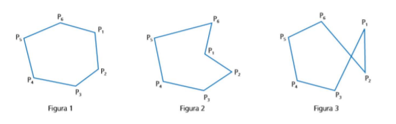
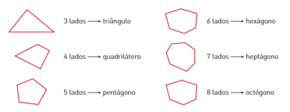
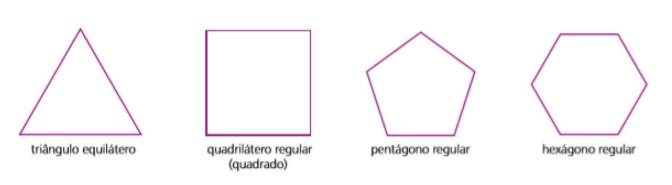

# Polígonos

## 1. Definição e Classificação
- Polígono: figura plana formada por segmentos de reta consecutivos não colineares, fechada, sem cruzamentos.

    

            

**Observação:**  figura 1 é um polígono simples convexo, e a figura 2 é um polígono simples não
convexo, são formadas por linhas poligonais que não se cruzam. A figura 3 não é um polígono, uma vez que há um cruzamento na linha. 

#### Classificação quanto à convexidade
1. Polígono convexo: qualquer segmento ligando dois pontos internos permanece dentro do polígono.
2. Polígono côncavo (não convexo): existe pelo menos um segmento entre dois pontos internos que sai do polígono.

#### Nomenclatura conforme número de lados (n)
- 3: triângulo
- 4: quadrilátero
- 5: pentágono
- 6: hexágono
- 7: heptágono
- 8: octógono
- 9: eneágono
- 10: decágono
- 12: dodecágono

    

            

## 2. Ângulos em Polígonos Convexos

#### Soma dos ângulos internos (Si)
- Si = 180° × (n − 2)

#### Soma dos ângulos externos (Se)
- Se = 360° (para qualquer polígono convexo)

## 3. Polígonos Regulares
- Polígono regular: todos os lados e todos os ângulos são congruentes.
- Exemplos:

    

       

#### Medida do ângulo interno (ai)
- ai = 180° × (n − 2) / n

#### Medida do ângulo externo (ae)
- ae = 360° / n

#### Relação entre ai e ae
- ai + ae = 180°

## 4. Número de Diagonais (d)
- Diagonal: segmento que liga dois vértices não consecutivos.
- Fórmula:
  - d = n × (n − 3) / 2

## 6. Dicas para Resolução
1. Identifique se o polígono é regular (lados e ângulos iguais).
2. Use Si = 180°×(n−2) para soma dos ângulos internos.
3. Use d = n(n−3)/2 para número de diagonais.
4. Em polígonos regulares: ai = 180°×(n−2)/n e ae = 360°/n.
5. Sempre que possível, desenhe e divida a figura em triângulos para análise.
6. Para conversão grau-minuto: 1° = 60′.
