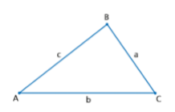
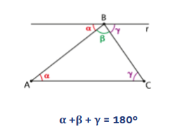
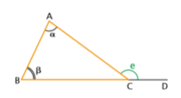
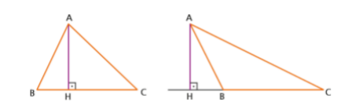
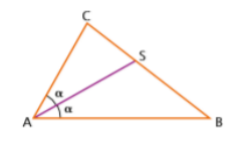
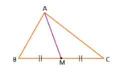
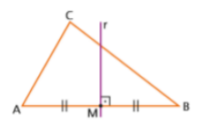
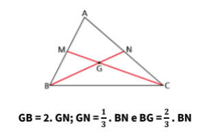
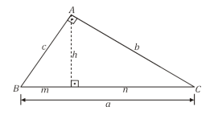

# Triângulos

## 1. Definição e Elementos
- Triângulo: polígono de três lados, formado por três pontos não colineares.
- Vértices: A, B, C
- Lados: AB, BC, AC (ou a, b, c)
- Ângulos internos: A, B, C

    

       

## 2. Condição de Existência (Desigualdade Triangular)
- Para três medidas a, b, c formarem um triângulo:
  - a < b + c  
  - b < a + c  
  - c < a + b

## 3. Soma dos Ângulos Internos
- Em qualquer triângulo:
  - A + B + C = 180°

    

       

## 4. Teorema do Ângulo Externo
- A medida de um ângulo externo (e) é igual à soma dos ângulos internos não adjacentes:
  - e = A + B

    

       

## 5. Classificação dos Triângulos

#### Quanto aos lados
1. Escaleno: três lados diferentes.
2. Isósceles: dois lados iguais.
3. Equilátero: três lados iguais (ângulos = 60°).

#### Quanto aos ângulos
1. Acutângulo: três ângulos agudos (< 90°).
2. Retângulo: um ângulo reto (= 90°).
3. Obtusângulo: um ângulo obtuso (> 90°).

## 6. Elementos Notáveis do Triângulo

#### 6.1 Altura (h)
- Segmento de um vértice perpendicular ao lado oposto.
- As três alturas se encontram no ortocentro.

    

       

#### 6.2 Bissetriz Interna
- Segmento que divide um ângulo interno ao meio.
- As três bissetrizes se encontram no incentro.

    

       

#### 6.3 Mediana
- Segmento de um vértice ao ponto médio do lado oposto.
- As três medianas se encontram no baricentro.

    

       

#### 6.4 Mediatriz
- Reta perpendicular a um lado passando pelo seu ponto médio.
- As três mediatrizes se encontram no circuncentro.

    

       

## 7. Baricentro (Propriedade)
- O baricentro divide cada mediana na razão 2:1.
- Do vértice ao baricentro: 2 partes
- Do baricentro ao ponto médio: 1 parte
- Exemplo: mediana = 12 cm → baricentro divide em 8 cm e 4 cm.

    

       

## 8. Semelhança de Triângulos
- Dois triângulos são semelhantes se:
  - Ângulos correspondentes iguais e
  - Lados correspondentes proporcionais.

#### Casos de semelhança
1. AA (Ângulo-Ângulo): dois ângulos iguais.
2. LAL (Lado-Ângulo-Lado): dois lados proporcionais e o ângulo entre eles igual.
3. LLL (Lado-Lado-Lado): três lados proporcionais.

## 9. Triângulo Retângulo – Relações Métricas

#### Elementos
- Hipotenusa (a): lado oposto ao ângulo reto.
- Catetos (b e c): lados que formam o ângulo reto.
- Altura relativa à hipotenusa (h).
- Projeções dos catetos sobre a hipotenusa (m e n).

#### Relações
1. Teorema de Pitágoras: a² = b² + c²
2. Cateto ao quadrado: b² = a·n ; c² = a·m
3. Produto dos catetos: b·c = a·h
4. Altura ao quadrado: h² = m·n

    

       

## 10. Dicas para Resolução
1. Em triângulos isósceles, ângulos da base são iguais.
2. Para triângulos retângulos com catetos 3 e 4, hipotenusa = 5 (e múltiplos).
3. Use semelhança quando houver paralelas ou alturas.
4. Baricentro divide medianas na razão 2:1.
5. Em questões de sombra ou rampas, identifique triângulos semelhantes.