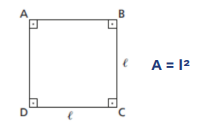
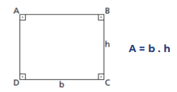
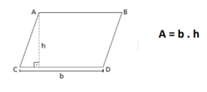
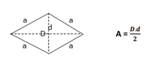

# Áreas de Figuras Planas

## 1. Unidades de Medida de Área
- Unidade padrão: metro quadrado (m²)
- Sistema métrico (cada passo multiplica ou divide por 100):
  - km² – hm² – dam² – m² – dm² – cm² – mm²

## 2. Área do Quadrado
- Fórmula:
  - A = l²  
  - (l = lado)

    

         

## 3. Área do Retângulo
- Fórmula:
  - A = b × h  
  - (b = base, h = altura)

    

         

## 4. Área do Paralelogramo
- Fórmula:
  - A = b × h  
  - (h é altura perpendicular à base)

    

         

## 5. Área do Trapézio
- Fórmula:
  - A = (B + b) × h / 2  
  - (B = base maior, b = base menor, h = altura perpendicular)

    

         

## 6. Área do Losango
- Fórmula:
  - A = (D × d) / 2  
  - (D = diagonal maior, d = diagonal menor)

#### Propriedades do losango
- Diagonais são perpendiculares.
- Diagonais se cruzam no ponto médio.

    

         