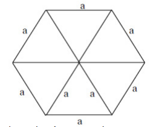

# Áreas de Figuras Planas

## 1. Área do Triângulo – Fórmulas Principais

#### 1.1 Fórmula básica (mais usada)
- Fórmula:
  - A = (b × h) / 2

#### 1.2 Usando trigonometria (dois lados e ângulo entre eles)
- Fórmula:
  - A = (a × b × sen α) / 2

#### 1.3 Triângulo equilátero (lado = L)
- Fórmula:
  - A = (L²√3) / 4

    

            

## 3. Área do Círculo e Setor Circular

#### 3.1 Círculo
- Fórmula:
  - A = πr²

#### 3.2 Setor circular (fatia)
- Usar regra de três proporcional ao ângulo central α: (α / 360°) × πr²  
- Ou fórmula direta: A = (α × πr²) / 360

## 5. Área do Hexágono Regular
- Hexágono regular = 6 triângulos equiláteros.
- Fórmula:  
  - A = 6 × (L²√3 / 4) = (3L²√3) / 2

    

         