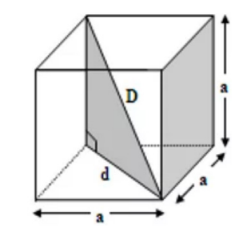
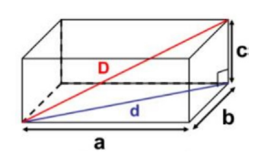

# Volume

## 1. Cubo (Hexaedro Regular)
- Formado por 6 faces quadradas iguais.

#### Fórmula do volume
- V = a³, onde a é a medida da aresta.

    

       

## 2. Paralelepípedo Reto-Retângulo
- Prisma com 6 faces retangulares.

#### Fórmula do volume
- V = a × b × c, onde a, b e c são comprimento, largura e altura.

    

       

## 3. Casos Especiais (Princípio de Cavalieri)
- Para a maioria das figuras, o volume = área da base × altura, com duas exceções principais:

#### 3.1 Figuras "Pontudas" (Cone e Pirâmide)
- Volume = (área da base × altura) / 3.

#### 3.2 Esfera
- Volume = (4πr³) / 3.

## 4. Conversão de Unidades de Volume
- 1 L = 1 dm³
- 1 mL = 1 cm³
- Para converter cm³ para m³, divide-se por 1.000.000 (ou converte-se as medidas para metros antes do cálculo).

## 5. Observações Importantes
- Sempre atentar para a unidade de medida solicitada na resposta.
- Em problemas de empilhamento, considerar apenas a quantidade inteira de caixas por dimensão (desprezar o resto da divisão).
- Em problemas de percentual, calcular a parte em relação ao todo.