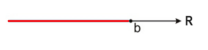
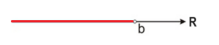
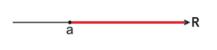
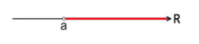
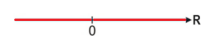

# Intervalos Reais

 

## DEFINIÇÃO
* É uma forma de representar um intervalo entre valores que formam um subconjunto dos números reais.
* Em geral são utilizados para representar conjuntos, subconjuntos de conjuntos e o resultado de equações.
* Tipos de notação:
  - Notação de intervalo;
  - Notação de conjunto;
  - Notação geométrica.
* Intervalo aberto o extremo não faz parte.
* Intervalo fechado o extremo faz parte.

#### Representação de intervalo e de conjunto
* ]a,b[ ou (a,b) = {x ∈ R | a < x < b}
* [a,b] = {x ∈ R | a ≤ X ≤ b}
* [a,b[ ou [a,b) = {x ∈ R | a ≤ x < b}
* ]a,b] ou (a,b] = {x ∈ R | a < x ≤ b}
* ]-∞,b] ou (-∞,b] = {x ∈ R | x ≤ b}
* ]-∞,b[ ou (-∞,b) = {x ∈ R | x < b}
* [a,+∞[ ou [a,+∞) = {x ∈ R | x ≥ a}
* ]a,+∞[ ou (a,+∞) = {x ∈ R | x > a}
* ]-∞,+∞[ ou (-∞,+∞) = R

Ex: S = {x ∈ R | 10 < x < 25}  
1. ]10, 25[

Ex: S = {x ∈ R | -4 ≤ x < 16}  
1. [-4, 16[

#### Representação geométrica

   
Intervalo Aberto de Extremos:

    
</di>
 
 

   
Intervalo Fechado de Extremos:

   
</di>
 
 

   
Intervalo Aberto à Direita:

   
</di>
 
 

   
Intervalo Aberto à Esquerda:

   
</di>
 
 

   
Semirreta esquerda, fechada, de origem b:

   
</di>
 
 

   
Semirreta esquerda, aberta, de origem b:

   
</di>
 
 

   
Semirreta direita, fechada, de origem a:

   
</di>
 
 

   
Semirreta direita, aberta, de origem a:

   
</di>
 
 

   
Reta numérica:

   
</di>