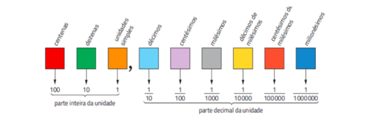

# Números Decimais

 

## DEFINIÇÃO
* São números racionais não inteiros, expressos por vírgula e que possuem casas decimais.
* São formadas por duas partes: a parte inteira (antes da vírgula) e a parte fracionária (após a vírgula). A parte fracionária é formada por casas decimais.

#### Representação

   
</di>

 

Ex: 0,2 = Dois décimos    
Ex: 3,56 = Três inteiros e cinquenta e seis centésimos    
Ex: 1,101 = Um inteiro e cento e um milésimos  

### Conversão de número decimal em fração
* Para transformar um número decimal em fração, deve-se retirar a vírgula, colocar o número em forma de fração, definindo como denominador o 1, seguido **n** zeros correspondente ao número de casas decimais após a vírgula.

Ex: 14,8 = 148/10  
Ex: 7,4 = 74/10     
Ex: 180,00 = 180/100    

***DICA:*** Para transformar dízimas períodicas em forma de fração, coloca-se como numerador o valor da dízima e coloca-se como denominador o **9** o número de vezes correspondente as casas da dízima.

Ex: 0,222... = 2/9  
Ex: 0,4545... = 45/99