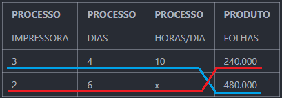

# Regra de Três

 

## REGRA DE TRÊS SIMPLES
* É um processo para resolução de problemas envolvendo duas grandezas, em que a proporção que as forma possui um dos valores desconhecido.
* A regra de três pode ser diretamente ou inversamente proporcional.

#### Cálculo
1. Identificar as grandezas dadas e ordena-las em uma proporção, deixando a icógnita sempre como consequente.
2. Identificar se é a relação entre as grandezas é direta ou inversamente proporcional.
3. Para regra de três direta, multiplica-se de forma cruzada.
4. Para regra de três inversa, multiplica-se de forma horizontal.
5. Isola-se a icógnita dividindo os outros valores, para encontrar o seu valor.

Ex: Um carro percorre 10 metros em 30 segundos, em quanto tempo percorrerá 200 metros?  
1. montar a proporção => 10/200 = 30/x 
2. identificar a relação das grandezas => relação direta (se aumenta a distância, aumenta o tempo)
3. multiplicar cruzado => 10 . x = 200 . 30 => 10x = 6000
4. isolar a icógnita => x = 6000/10 => x = 600
5. logo para percorrer 200 metros levará 600 segundos

Ex: 5 máquinas cortam a grama em 120 minutos, 12 máquinas cortaram em quanto?  
1. montar a proporção => 5/12 = 120/x 
2. identificar a relação das grandezas => relação inversa (se aumenta a quantidade de máquinas, diminui o tempo para cortar)
3. multiplicar na horizontal => 5 . 120 = 12 . x => 12x = 10 
4. isolar a icógnita => x = 600/12 => x = 50
5. logo as 12 máquinas vão cortar a grama em 50 minutos

## REGRA DE TRÊS COMPOSTA
* É um processo para resolução de problemas envolvendo três ou mais grandezas, em que a proporção que as forma possui um dos valores desconhecido.
* A regra de três pode ser diretamente ou inversamente proporcional.

##### CÁLCULO
1. Identificar as grandezas dadas e ordena-las entre processos (ações) e produto (resultado das ações) na reta em x.
2. Identificar as novas grandezas com a grandeza que se quer obter (icógnita) e ordenar abaixo das anteriores na reta em x.
3. Multiplicar as grandezas dadas seguindo os elementos da linha superior da reta em x.
4. Multiplicar as novas grandezas seguindo os elementos da linha inferior da reta em x.
5. Igualar as duas multiplicações.
6. Isolar a icógnita dividindo os outros valores, para encontrar o seu valor.

Ex: Numa fábrica 3 impressoras imprimem 240 mil folhas em 4 dias, trabalhando 10 horas por dia. Com uma impressoa a menos quantas horas por dias de trabalho serão necessários para se imprimir 480 mil folhas em 6 dias?

1. organizar as grandezas em processos e produto

| PROCESSO   | PROCESSO  | PROCESSO  | PRODUTO |             
| ---------- | --------- |-----------| ------- |
| IMPRESSORA | DIAS      | HORAS/DIA | FOLHAS  |
| 3          | 4         | 10        | 240.000 |
| 2          | 6         | x         | 480.000 |

2. identificar com a reta em x as grandezas

 

    

3. multiplicar as grandezas em seus respectivos membros => 3 . 4 . 10 . 480000 = 2 . 6 . x . 240000 => 57.600.000 = 2.880.000x
4. isolar a icógnita e encontrar o seu valor => x = 57.600.000/2.880.000 => x = 20
5. logo serão necessárias 20 horas por dia de trabalho das impressoras 