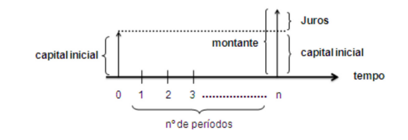
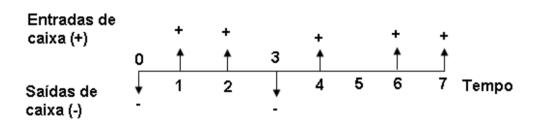
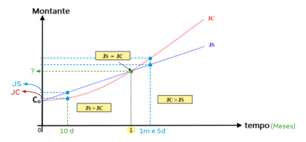

# Conceitos Gerais de Matemática Financeira

 

## JUROS
* Juros é uma compensação, aplicada a uma unidade monetária. Esse benefício é um incentivo que visa recompensar seu proprietário, por abrir mão do valor presente que possui em troca de um valor futuro.
* Os juros são aplicados a diversas relações financeiras, como operações de crédito para compensar a falta de recursos, aplicações de manutenção do valor de compra, criação de reservas, e elevação do valor titular a partir da valorização desse valor com o tempo.
* O juros é uma taxa, definida a partir do cálculo das variáveis:
  - Risco envolvido na operação;
  - Perda do poder de compra causada pela inflação;
  - Custo de oportunidade.
* Os juros também podem ser chamados de:
  - Rendimento do capital;
  - Ganho sobre o capital;
  - Remuneração do capital.

## CAPITAL INICIAL
* O capital inicial é a quantia de dinheiro que se tem ou que se recebe. É o valor inicial aplicado a uma operação financeira.
* O capital inicial é o valor aplicado em uma transação financeira, essa que sempre apresenta um credor (dono do capital) e um devedor (quem recebe o capital aplicado).
* O capital inicial pode ser chamado de:
  - Capital;
  - Principal;
  - Valor presente;
  - Valor inicial;
  - Valor aplicado;
  - Depósito inicial.

## MONTANTE
* É o resultado final da aplicação de um valor. Ele é formado pelo capital inicial, acrescido dos juros cobrados na operação realizada.
* Na ótica do proprietario, o montante é o seu valor presente, adicionado da remuneração por ter aberto mão dele no momento presente. Já na ótica do tomador do capital, o montante é o valor captado, somado com os juros pagos por ter pego o valor.
* O montante pode ser chamado de:
  - Capital final;
  - Valor futuro;
  - Valor de resgate;
  - Capital + juros;
  - Valor final;
  - Valor capitalizado.

## PERÍODO
* É o espaço de tempo em que o capital fica aplicado. Sua representação pode ser feita a partir de diferentes unidades de tempo como: dias, meses, bimestres, trimestres, semestres e anos.
* O tempo é a variável a partir da qual está condicionada o valor do capital, pois o capital evolui conforme o tempo passa.

## TAXA DE JUROS
* É o coeficiente que determina o valor do juro, ou seja, é a métrica que define a remuneração do capital por período de tempo. 
* Ela é formada por uma unidade definida que representa a compensação por cada fração (centésima) do capital por um período. O período indica de quanto em quanto tempo incidirá sobre o capital a taxa de compensação por cada parte dele.
* A unidade de taxa de juros é representada na forma unitária ou na forma percentual.
* A forma como se da a incidência da taxa de juros no capital, vai variar conforme o seu regime de capitalização.

> ### Regimes de capitalização
* Determina quais as regras de capitalização pelas quais o juros serão transformados, e adicionados ao capital. 
* Existem dois regimes de capitalização:
  - Juros simples (ou linear);
  - Juros compostos (ou exponencial).

#### Juros simples
* Regime de capitalização em que a taxa de juros incide sempre sobre o capital inicial.
* Em aplicações de um único período, tanto o juros simples como o composto, produzem o mesmo montante. 
* Em aplicações onde o prazo da operação for menor do que o período de tempo (menor do que um período de tempo) o juros simples produzem um montante maior do que os juros compostos.

#### Juros compostos
* Regime de capitalização em que a taxa de juros incide sempre sobre o valor do período anterior.
* Em aplicações de um único período, tanto o juros simples como o composto, produzem o mesmo montante. 
* Em aplicações em que o prazo da operação for maior do que o período de tempo (maior do que um período de tempo) os juros compostos produzem um montante maior do que os juros simples.

## REPRESENTAÇÃO GRÁFICA DOS ELEMENTOS QUE FORMAM AS OPERAÇÕES DE JUROS

#### Aplicação do capital

    

 
 
 
 
 
 
 

#### Diagrama de fluxo de caixa

    

 
 
 
 
 
 
 

#### Comparação entre regime simples e regime composto

    

