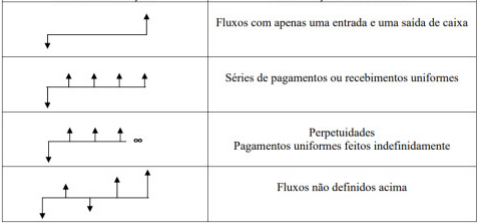

# Fluxos de Caixa

 

## DEFINIÇÃO
* Fluxo de Caixa (cash flow em inglês) é um registro ou projeção de uma sequência de movimentações financeiras ao longo do tempo. 
* O principal objetivo do fluxo de caixa é fornecer informações para a tomada de decisões a partir de uma visão futura dos recursos financeiros que integram suas contas.
* Ele pode se apresentar em forma de gráfico ou tabela como uma previsão de entradas e saídas de uma empresa, família, ou de um empréstimo isolado. 

#### Gráfico

 

    

            

**Observação:** As entradas de recursos são representadas por setas orientadas para cima, perpendiculares ao eixo horizontal. Já as saídas de recursos são representadas da mesma forma, porém as setas serão colocadas para baixo. O eixo horizontal é o tempo. A flecha para baixo significa que saída de valor. A flecha para cima significa que entrada de valor.

#### Tabela

| MÊS | OPERAÇÃO  | VALOR        |
| --- | --------- | ------------ |
| 0   | Aplicação | R$ -2.000,00 |
| 1   | Aplicação | R$ -2.000,00 |
| 2   | Resgate   | R$ 650,00    |
| 3   | Resgate   | R$ 650,00    |
| 4   | Resgate   | R$ 650,00    |
| 5   | Resgate   | R$ 650,00    |
| 6   | Resgate   | R$ 650,00    |

**Observação:** Os valores negativos são as saídas, já os positivos as entradas. Os valores de saída também podem ser expressos entre parênteses.